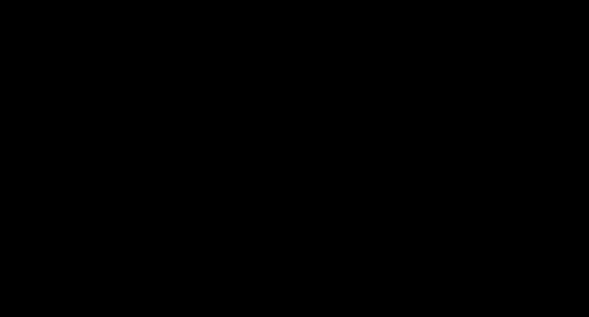

# noon
Experimental animation library with high-level APIs for vector graphics animation.
  


## Motivation
noon is an animation library that allows you to draw 2D objects and animate them with high-level commands. This project draws inspiration from [manim](https://github.com/3b1b/manim), which is used to create [educational videos about math](https://www.youtube.com/c/3blue1brown). While Python is a great language for end-users, it would be
interesting to explore similar implementation in a compiled language and the possibilities that it would enable, such as real-time interactions and deploying to the web. Along the way, I became interested in Rust and tried to apply it for my learning in this project.

## Architecture
Noon is designed as a thin animation-wrapper on top of an awesome existing library called
[nannou](https://github.com/nannou-org/nannou). Nannou and it's dependent crate [lyon](https://github.com/nical/lyon) makes drawing custom shapes rendered in GPU much easier than it would otherwise be using Rust. 

To use nannou's per-frame drawing API with noon's animation commands, we cache the user commands in order to interpolate them during animation run-time. Since each animation attributes (e.g. position, size, etc.) are usually independent from one another and we can have many shapes in a scene, noon uses [Bevy ECS](https://github.com/bevyengine/bevy) to keep track of independent animation attributes. This also allows us bypass some tricky ownership-related issues that could arise when dealing with multiple references.

## Examples
The following examples demonstrate the current status of this project.
  

```rust
// cargo run --release --example hello_world

fn scene(win_rect: Rect) -> Scene {
	// Make a blank scene
    let mut scene = Scene::new(win_rect);

	// Instantiate a rectangle with builder pattern
    let rect = scene
        .rectangle()
        .with_position(2.0, 0.0)
        .with_color(Color::random())
        .make();

	// Make a circle
    let circle = scene
        .circle()
        .with_position(-2.0, 0.0)
        .with_color(Color::random())
        .make();

	// Wait for a second
    scene.wait();
	// Show animation for creating the rectangle with builder animation attributes
    scene.play(rect.show_creation()).run_time(1.5);
    scene.play(circle.show_creation()).run_time(1.5);
	// Morph circle into rectangle
    scene.play(circle.morph(rect)).run_time(1.5);

    scene
}
```
  

```rust
// cargo run --release --example morph

fn scene(win_rect: Rect) -> Scene {
    let mut scene = Scene::new(win_rect);

	// Make a text object
    let text = scene.text().with_font_size(50).with_text("Hello!").make();
    let rectangle = scene.rectangle().with_position(2.0, 0.0).make();
    let circle = scene.circle().with_position(-2.0, 0.0).make();
	// Make a line object
    let line = scene.line().from(-2.0, -2.0).to(2.0, 2.0).make();

	// Scene::play can receive multiple animation commands in a Vec
    scene
        .play(vec![
            line.show_creation(),
            circle.show_creation(),
            rectangle.show_creation(),
            text.show_creation(),
        ])
        .lag(1.0); // lag specifies the time delay between each animation

	// run_time specifies the duration of each animation
    scene
        .play(vec![
            line.morph(circle),
            circle.morph(rectangle),
            rectangle.morph(text),
        ])
        .run_time(2.0)
        .lag(2.0);

    scene
}
```
  

```rust
// cargo run --release --example morph_text

fn scene(win_rect: Rect) -> Scene {
    let mut scene = Scene::new(win_rect);

	// Create an empty Vec to contain multiple animations
    let mut morph = Vec::new();
    let mut show = Vec::new();

	// Each animation can be added in a for-loop
    for _ in 0..3 {
        let text2 = random_text(&mut scene, "This example shows shape transfrom");
        show.push(text2.show_creation());

        let text = random_text(&mut scene, "Hello World! This is some text");
        show.push(text.show_creation());

        morph.push(text.morph(text2));
        morph.push(text2.fade_out());
    }

    scene.play(show).run_time(3.0);
    scene.wait_for(0.5);
    scene.play(morph).run_time(3.0);

    scene
}
```
  

```rust
// cargo run --release --example easing

fn scene(win_rect: Rect) -> Scene {
    let mut scene = Scene::new(win_rect);

    let mut circles = Vec::new();
    let mut show = Vec::new();
    let mut to_right = Vec::new();

    for i in 0..8 {
        let c = scene
            .circle()
            .with_position(-4.0, 2.0 - i as f32 * 0.5)
            .with_radius(0.2)
            .with_color(Color::random())
            .make();

        circles.push(c);
        show.push(c.fade_in());
        to_right.push(c.move_by(8.0, 0.0));
    }

    scene.wait();
    scene.play(show).lag(0.2);

	// These easing functions are available for all animation attributes,
	// e.g. position, color, path, angle, scale, etc.
    let easing = [
        EaseType::Linear,
        EaseType::Quad,
        EaseType::Quint,
        EaseType::Expo,
        EaseType::Sine,
        EaseType::Back,
        EaseType::Bounce,
        EaseType::Elastic,
    ];
    for i in 0..8 {
        scene
            .play(to_right[i].clone())
            .lag(0.5)
            .rate_func(easing[i]);
    }

    scene
}
```
  

```rust
// cargo run --release --example shapes

fn scene(win_rect: Rect) -> Scene {
    let mut scene = Scene::new(win_rect);

    let mut animations = Vec::new();
    let mut show = Vec::new();
    let mut move_down = Vec::new();

    for _ in 0..1000 {
        if noon::rand::random::<bool>() {
            let (x, y, w, _h, ang, color) = gen_random_values();
            let circle = scene
                .circle()
                .with_position(x, y)
                .with_angle(ang)
                .with_color(color)
                .with_thin_stroke()
                .with_radius(w / 2.0)
                .make();

            show.push(circle.show_creation());
            move_down.push(circle.to_edge(Direction::Down));

            let (x, y, w, _h, _ang, color) = gen_random_values();
            animations.extend(vec![
                circle.set_color(color),
                circle.move_to(x, y),
                circle.set_radius(w / 2.0),
            ]);
        } else {
            let (x, y, w, h, ang, color) = gen_random_values();
            let rect = scene
                .rectangle()
                .with_position(x, y)
                .with_angle(ang)
                .with_color(color)
                .with_thin_stroke()
                .with_size(w, h)
                .make();

            show.push(rect.show_creation());
            move_down.push(rect.to_edge(Direction::Down));

            let (x, y, w, _h, ang, color) = gen_random_values();
            animations.extend(vec![
                rect.set_color(color),
                rect.move_to(x, y),
                rect.set_size(w, h),
                rect.rotate(ang),
            ]);
        }
    }

    scene.wait_for(0.5);
    scene.play(show).run_time(1.0).lag(0.001);

    scene
        .play(animations)
        .run_time(3.0)
        .lag(0.0001)
        .rate_func(EaseType::Quint);

    scene
        .play(move_down)
        .run_time(1.0)
        .rate_func(EaseType::BounceOut)
        .lag(0.001);

    scene
}
```


