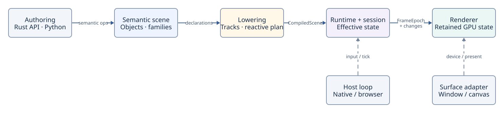

# Noon

Noon is a high-performance 2D animation system targeting **Manim-compatible Python authoring** on top of a deterministic, language-neutral Rust/WebGPU execution core.

The project treats Manim's common 2D authoring semantics as a cross-language contract: Python should be source-compatible where Noon can reproduce the behavior without a fundamental design or performance regression, while Rust and future frontends expose the same concepts and observable semantics idiomatically. Python adapters normalize syntax and types; they do not implement a second animation engine.

## Architecture

Rust `Scene`/`Mobject` and Python/WASM handles invoke shared authoring operations.
The component view below follows the resulting state into execution and rendering:



[D2 source](docs/diagrams/overview.d2) · [Domain projections](docs/architecture.md#domain-projections) · [Current crate ownership](docs/architecture.md#current-implementation-ownership) · [Python worker topology](docs/architecture.md#host-language-or-multi-worker-topology).

Nesting shows composition; arrows show data flow, not crate dependencies.
`noon-compile` derives slot mappings, tracks and resource projections.
`ExecutionSession` coordinates the existing `SceneInstance`; its compiled data is
kept alongside effective `FrameState`, while rendering retains meshes, glyphs and
instance buffers. This separates authored structure, time-varying values and GPU
residency so a property change need not rebuild content.

Native and direct single-context Rust/WASM hosts consume a typed
`RendererPublication` (frame, changes and resource references). The optional Python
worker path transports derived output instead; platform placement and callbacks
are expanded in the linked detail views.

Key invariants:

- one Semantic Scene is the only authored scene authority;
- high-level object, lifecycle, layout, animation, signal, updater, and interaction semantics are implemented once and shared by every frontend;
- Python wrappers hold handles into shared semantic state rather than duplicating scene state, timing, layout, or scheduling logic;
- lowering specializes immutable, timeline, native-reactive, and host-dynamic dependencies independently;
- static/prepared geometry and resources remain retained and are not rebuilt for unrelated property changes;
- local semantic/runtime changes remain local through execution and rendering;
- arbitrary Python callbacks are explicit host-dynamic slots and do not put Python on the normal frame path;
- playback is deterministic and supports arbitrary seek/rewind wherever the program semantics permit it;
- serialization is a codec, not another scene architecture.

The single authoritative architecture and roadmap is [`docs/architecture.md`](docs/architecture.md). If code or an older document conflicts with it, `docs/architecture.md` wins. Noon is greenfield: migration compatibility is not a reason to preserve obsolete internal architecture.

## Authoring

For supported 2D features, ordinary ManimCE source should require only the import change from `manim` to `noon`:

```python
from noon import *

class Demo(Scene):
    def construct(self):
        circle = Circle(radius=0.6, color=BLUE).shift(LEFT * 2)
        square = Square(side_length=1.2, color=PINK)
        square.next_to(circle, RIGHT)

        self.play(Create(circle), Create(square))
        self.play(
            circle.animate.shift(RIGHT * 2),
            square.animate.rotate(45 * DEGREES),
            run_time=2,
            rate_func=smooth,
        )
        self.play(Transform(circle, Square(1.4, color=PURPLE)), run_time=1.5)
        self.wait(0.5)
```

The public Rust `Scene` and `Mobject` API authors directly into the same semantic store used by the WASM handles:

```rust
use noon::Scene;

let mut scene = Scene::new();
let mut circle = scene.circle(0.6)?;
circle.shift(-2.0, 0.0)?;
circle.set_fill(0.0, 0.0, 1.0, 0.5)?;
let mut square = scene.square(1.2)?;
square.next_to_handle(&circle, 1.0, 0.0, 0.25)?;
scene.add(&circle)?;
scene.add(&square)?;
let session = scene.execution_session()?;
assert_eq!(session.frame().objects.len(), 2);
```

Constructors are scene-bound factories, `Scene::add` attaches the existing node, and handle queries return errors for stale identities. Copies allocate independent nodes in the same store. See [`shared_authoring.rs`](crates/noon/examples/shared_authoring.rs) for typed lowering and runtime execution.

### Ordinary API versus integration

The crate root and `noon::prelude` deliberately export authoring handles, values,
live operations, completion and errors. Implementation modules and blanket
lower-layer exports are not public authoring APIs. `noon::integration` explicitly
exposes the raw semantic/resource types and host/callback/renderer plumbing needed
by adapters. `noon::diagnostics` is feature-gated debug/export access. None of these
namespaces introduces another scene, runtime, scheduler or integration crate.

`Scene::revision()` reads the authored revision without mutable arena access.
`Scene::geometry(ManimGeometryOptions)` constructs a detached specialized shape;
after lowering, use `LiveSession::create_manim_geometry` instead. The
[`shared_authoring` example](crates/noon/examples/shared_authoring.rs) shows
construction, authored/effective queries, live edits and two logical completions
using only ordinary public APIs. It is the direct Rust counterpart of
[`live_affine_completion.py`](web/python/examples/live_affine_completion.py), which
remains in the browser authoring qualification suite.

Raw integration is deliberately named: `Scene::with_integration_store` accepts a
shared arena; `Scene`, `Mobject` and `MobjectFamily` expose it through
`integration_store()`. This is not a snapshot or a live-mutation shortcut. Release
RefCell borrows before calling authoring/session APIs. Edits made outside coherent
publication can stale the existing session; its identity/revision checks still
reject them. A consumer that already made such an edit must explicitly discard
and rebuild that session, not alter its revision bookkeeping. No old-name aliases
are retained. The `RetainedScene` text adapter in `noon::integration` remains a
transport-consumer facility owned for deletion by #959, not the ordinary Scene API.

After creating a session, use `scene.live(&mut session)` for shared property edits, append-compatible membership changes, predeclared affine animations, and replacement with content already owned by the semantic store. Property and structural edits use `ExecutionSession::apply_semantic_transaction` to prepare semantic changes and typed execution publication together, so a failed edit leaves authored and live states unchanged.

Rust uses `live.effective(&object)` or `live.effective_layout(&object)` for coherent runtime values; ordinary Rust `Mobject` inspection explicitly reads authored/base state. Python `get_center`, `width`, and `height` route through the same effective layout while its canonical context owns a live session, fall back to authored layout before bootstrap, and reject reads while that session is transferred.

`live.complete_segment(segment)` in Rust and `live.complete()` in Python reconcile a supported affine endpoint into authored state before releasing its timeline driver, so later authored setters survive subsequent frames. Flat Parallel/Sequence compositions use the same prepared semantic transaction, shared schedule, runtime, and mapped completion barrier. Direct handle mutations after initial lowering make that session's scene revision stale. Live resource allocation, interleaved membership ordering, reactive-topology changes, instantaneous completion, overlapping-driver release, sequential duplicate-property drivers, and historical replay of unrecorded authored mutations remain unsupported. Original deterministic track intervals remain available for seek.

Python geometry and text scenes, including the explicit `live_execution()` facade, execute from their shared semantic handles. The browser sends execution deltas across the actual worker boundary. The native and direct Rust/WASM paths remain typed in-process. Some Manim timeline and callback features still use migration code while their shared continuation contracts are completed. `PythonAuthoringClient.run` returns only a shared semantic execution descriptor; document exports are not authoring results.

Equivalent examples run through the native Rust renderer and the Python browser host:

| Feature | Rust | Python |
| --- | --- | --- |
| Geometry and text | [shared_text.rs](crates/noon-native/examples/shared_text.rs) | [shared_text.py](web/python/examples/shared_text.py) |
| Live membership | [live_semantic_scene.rs](crates/noon-native/examples/live_semantic_scene.rs) | [live_semantic_scene.py](web/python/examples/live_semantic_scene.py) |
| Affine animation | [live_affine_animation.rs](crates/noon-native/examples/live_affine_animation.rs) | [live_affine_animation.py](web/python/examples/live_affine_animation.py) |
| Returning transform completion | [returning_transform.rs](crates/noon-native/examples/returning_transform.rs) | [returning_transform.py](web/python/examples/returning_transform.py) |
| Mixed geometry/Text family fades | [mixed_family_fade.rs](crates/noon-native/examples/mixed_family_fade.rs) | [mixed_family_fade.py](web/python/examples/mixed_family_fade.py) |
| Live masked placement | [live_masked_placement.rs](crates/noon-native/examples/live_masked_placement.rs) | [live_masked_placement.py](web/python/examples/live_masked_placement.py) |
| Affine completion | [live_affine_completion.rs](crates/noon-native/examples/live_affine_completion.rs) | [live_affine_completion.py](web/python/examples/live_affine_completion.py) |
| Sequential ordinary affine play | [ordinary_affine_play.rs](crates/noon-native/examples/ordinary_affine_play.rs) | [ordinary_affine_play.py](web/python/examples/ordinary_affine_play.py) |
| Ordinary FadeIn/FadeOut lifecycle | [ordinary_fade_play.rs](crates/noon-native/examples/ordinary_fade_play.rs) | [ordinary_fade_synchronous_continuation.py](web/python/examples/ordinary_fade_synchronous_continuation.py) |
| Ordinary affine callback continuation | [ordinary_affine_callback_continuation.rs](crates/noon-native/examples/ordinary_affine_callback_continuation.rs) | [ordinary_affine_callback_continuation.py](web/python/examples/ordinary_affine_callback_continuation.py) |
| Scoped scalar callback reads | [ordinary_callback_sparse_reads.rs](crates/noon-native/examples/ordinary_callback_sparse_reads.rs) | [ordinary_callback_sparse_reads.py](web/python/examples/ordinary_callback_sparse_reads.py) |
| Flat ordinary composition | [ordinary_composition_play.rs](crates/noon-native/examples/ordinary_composition_play.rs) | [ordinary_composition_play.py](web/python/examples/ordinary_composition_play.py) |
| Flat ordinary composition continuation | [ordinary_composition_continuation.rs](crates/noon-native/examples/ordinary_composition_continuation.rs) | [ordinary_composition_continuation.py](web/python/examples/ordinary_composition_continuation.py) |
| Sequential transform targets | [sequential_transform_targets.rs](crates/noon-native/examples/sequential_transform_targets.rs) | [sequential_transform_targets.py](web/python/examples/sequential_transform_targets.py) |
| Point-correspondence and angular rotation | [ordinary_different_rotations.rs](crates/noon-native/examples/ordinary_different_rotations.rs) | [manim_parity_different_rotations.py](web/python/examples/manim_parity_different_rotations.py) |
| Construct Circle/Square after a wait | [ordinary_live_primitive_construction.rs](crates/noon-native/examples/ordinary_live_primitive_construction.rs) | [ordinary_live_primitive_construction.py](web/python/examples/ordinary_live_primitive_construction.py) |
| Affine Grow/Spin/Shrink lifecycle | [ordinary_affine_lifecycle.rs](crates/noon-native/examples/ordinary_affine_lifecycle.rs) | [manim_parity_affine_lifecycle.py](web/python/examples/manim_parity_affine_lifecycle.py) |
| Nested Add/Wait, staggered Fade and re-entry | [ordinary_timed_composition.rs](crates/noon-native/examples/ordinary_timed_composition.rs) | [ordinary_timed_composition.py](web/python/examples/ordinary_timed_composition.py) |
| Mixed scalar and object composition | [ordinary_mixed_scalar_composition.rs](crates/noon-native/examples/ordinary_mixed_scalar_composition.rs) | [ordinary_mixed_scalar_composition.py](web/python/examples/ordinary_mixed_scalar_composition.py) |
| Family transform and restoring Indicate | [ordinary_family_transform_indicate.rs](crates/noon-native/examples/ordinary_family_transform_indicate.rs) | [ordinary_family_transform_indicate.py](web/python/examples/ordinary_family_transform_indicate.py) |
| Forward vector Write / DrawBorderThenFill | [ordinary_draw_border_then_fill.rs](crates/noon-native/examples/ordinary_draw_border_then_fill.rs) | [ordinary_draw_border_then_fill.py](web/python/examples/ordinary_draw_border_then_fill.py) |
| Scaled and translated fade lifecycle | [ordinary_affine_fade.rs](crates/noon-native/examples/ordinary_affine_fade.rs) | [ordinary_affine_fade.py](web/python/examples/ordinary_affine_fade.py) |
| Scalar ValueTracker continuation | [ordinary_value_tracker_continuation.rs](crates/noon-native/examples/ordinary_value_tracker_continuation.rs) | [ordinary_value_tracker_continuation.py](web/python/examples/ordinary_value_tracker_continuation.py) |
| Ordered property callbacks | [live_affine_callbacks.rs](crates/noon-native/examples/live_affine_callbacks.rs) | [live_affine_callbacks.py](web/python/examples/live_affine_callbacks.py) |
| Shared callback paint | [live_callback_paint.rs](crates/noon-native/examples/live_callback_paint.rs) | [live_callback_paint.py](web/python/examples/live_callback_paint.py) |
| Analytic Line endpoint callbacks | [live_line_match_callback.rs](crates/noon-native/examples/live_line_match_callback.rs) | [live_line_match_callback.py](web/python/examples/live_line_match_callback.py) |
| Windowed Line rotation callbacks | [live_line_callback_rotation.rs](crates/noon-native/examples/live_line_callback_rotation.rs) | [renderer_observation_line_callbacks.py](web/python/examples/renderer_observation_line_callbacks.py) |
| Content replacement | [live_content_switch.rs](crates/noon-native/examples/live_content_switch.rs) | [live_content_switch.py](web/python/examples/live_content_switch.py) |

Run a Rust example with `cargo run -p noon-native --example live_content_switch`, or paste its paired Python source into the playground. The shared browser smoke executes the published Python files and checks their rendered output.

The callback examples run forward through compiler-selected barriers. The ordinary continuation pairs one affine transform with ordered transform/style updates and resumes authoring only after its exact endpoint publication. The broader callback example also includes a separate `dt` accumulator. Callback `set_color` and `set_fill` use the same shared Rust paint rules as ordinary authoring; callback `set_opacity` remains the independent object-composite property. Callbacks read phase-consistent object and scalar values and stage property writes for active callback targets. Analytic Line endpoint matching stages a transform and preserves source paint; its temporary endpoint operand cannot escape the callback phase. Family callbacks, structural callback edits, and seeking or looping opaque callbacks are not supported. A callback failure stops progression at the last coherent frame.

The sequential transform examples use two preauthored target snapshots for one object. The second animation starts from the first animation's completed effective state. Overlapping writes still reject atomically. Repeated-target sequences involving content morphs, host updaters, or effects with precomputed family centers retain their existing restrictions until later activation can capture those dependencies safely.

The slow callback example, `web/python/examples/slow_host_updater.py`, demonstrates required callback barriers: slow Python holds authored time until its ordered writes are ready. `node scripts/execution-worker-host-smoke.mjs` checks exact samples and final shared rendering over both worker transports. The browser main thread remains responsive; required callback results are never dropped to maintain frame rate.

The API is intentionally mutable and interactive. The implementation is not forced to remain dynamic: predetermined animation lowers to compiled tracks, common reactive behavior lowers to a native dependency graph, and only semantics that genuinely require arbitrary host-language execution retain host callback slots.

When exact Manim behavior would require a material architectural or performance regression, Noon should first look for a deterministic or native-reactive equivalent. If none exists, the incompatibility must be explicit rather than silently approximated.

## Browser playground

The browser demo combines:

- Rust/WASM scene compilation and evaluation;
- WebGPU rendering with automatic WebGL2 fallback;
- a Pyodide worker for interactive Python authoring;
- shared Rust live mutations and source-session replacement on rerun;
- runtime and GPU profiling counters.

The current semantic Python path keeps the shared Rust/WASM semantic context **and its execution session in the authoring worker** beside Pyodide. Python calls shared operations synchronously through handles; the semantic engine endpoint leases the existing player in that same context. A separate render owner receives derived resource bundles and execution deltas over the actual worker boundary, using transferable buffers or a shared mailbox. Rendering can fall back to the main thread without moving semantic/runtime authority. Deterministic playback without host callbacks does not require per-frame Python interpreter execution. See the [current worker diagram](docs/architecture.md#host-language-or-multi-worker-topology).

Build the current demo from the repository root:

```bash
bash scripts/build-web-demo.sh
python3 -m http.server --directory web 8080
```

Then open `http://localhost:8080`.

Every scene exposed by the playground picker is authored through the shared Rust semantic operations and executed by the common runtime in CI before deployment.

## Workspace

The active implementation lives under `crates/`. Current responsibilities are:

- `noon` — public Rust API, shared authoring operations, and execution-session orchestration;
- `noon-core` — shared semantic identity/store, declarations, resources, and renderer-independent data contracts;
- `noon-compile` — semantic analysis, specialization, lowering, `CompiledScene`, root-order publication preparation, and geometry preparation;
- `noon-runtime` — deterministic mutable execution, reactive evaluation, scheduling, and incremental updates;
- `noon-render-wgpu` — retained WebGPU renderer;
- `noon-native` — native window/event-loop/surface integration, isolated by its platform dependencies;
- `noon-web` — WASM/browser integration;
- supporting geometry/text crates only where a real dependency or compilation boundary justifies them.

`noon-ir` and the obsolete browser scene/execution mirrors have been deleted. Explicit codec/export and frontend cleanup remain tracked by #959 and #61. Serialization is reserved for explicit codecs and genuine cross-context transport; it is not an in-process engine boundary.

The [current ownership diagram](docs/architecture.md#current-implementation-ownership) distinguishes this implementation from the target crate responsibilities. `SemanticStore` remains in `noon-core`, `CompiledScene` in `noon-compile`, and execution-session orchestration in `noon`. The target boundary remains defined by `docs/architecture.md`; #960 tracks the remaining separation. Diagram sources and checked-in SVGs are refreshed with `python3 scripts/architecture_diagrams.py`; CI checks that they agree.

Crates should correspond to real dependency or compilation boundaries. Prefer modules over crates until an independent build/dependency/reuse boundary exists.

## Development

The required CI gate runs:

```bash
cargo fmt --all -- --check
cargo check --workspace --all-targets --all-features
cargo clippy --workspace --all-targets --all-features -- -D warnings
cargo test --workspace --all-features
bash scripts/build-web-demo.sh
```

It also checks geometry correctness, browser-target compilation, Python playground execution, Manim compatibility smoke scenes, and native compilation of picker scenes.

The architecture roadmap requires additional validation around single-authority semantics, mutation atomicity, reactive dirty propagation, cross-language semantic parity, host callback batching, and mixed static/dynamic performance.

## Design priorities

In order:

1. one authoritative Semantic Scene and one lowering boundary;
2. Manim-compatible Python ergonomics and semantics for the supported 2D surface;
3. shared semantics across Python, Rust, and future frontends;
4. unrestricted interactivity and mutability without imposing dynamic overhead on static content;
5. deterministic correctness and direct-seek semantics where semantically possible;
6. automatic specialization and strict locality for high realtime and offline-render performance;
7. explicit, measured deviations only where exact Manim behavior has a fundamental design or performance blocker.

Compatibility is an API/semantic goal, not an implementation constraint: Noon does not copy Manim's renderer, internal point-cloud representation, Python-side scene engine, or Python-per-frame execution model.

## Optional Rust text providers

The `noon` crate keeps native text, Typst layout and bundled fonts enabled by
convenience defaults. Geometry-only consumers can opt out explicitly:

```toml
[dependencies]
noon = { path = "path/to/noon/crates/noon", default-features = false }
```

`native-text` enables `Text`, `Scene::text`, `Mobject::from_text` and live text
construction. `typst` enables `Typst`/`MathTypst` and their corresponding
constructors. `bundled-fonts` supplies the existing font assets, but does not
activate either compiler by itself. Native shaping with supplied fonts needs
only `features = ["native-text"]`; Typst with supplied fonts needs only
`features = ["typst"]`. Add `bundled-fonts` for family-based convenience lookup.
Typst still requires its upstream base assets (including PDF standard-font data);
disabling bundles excludes its optional typography font families, not those base
compiler resources. Geometry-only and native-text-only builds exclude Typst's
assets package entirely.

Supply native font bytes via `NativeFontFace::new(family, bytes, face_index)` and
`Text::with_font_face(face)`. Supply Typst font buffers via
`Typst::with_fonts` or `MathTypst::with_fonts` (an iterator of `Arc<[u8]>`). The
`noon-typst` backend also exposes `compile_typst_resource_with_fonts` for direct
resource integrations. These inputs normalize into the existing shared resource
store; they do not introduce another registry or execution path. Selecting a
native family with `with_font` clears an earlier explicit face. An empty or
invalid explicit Typst font set is an error even when bundled fonts are enabled.

Without bundles, family lookup fails with `TextAuthoringError::FontUnavailable`
and the Typst convenience constructors report `TypstBackendError::FontsUnavailable`.
There is no provider substitution. Provider-specific APIs are absent when their
feature is disabled; bundled-font reference scenes additionally require the
asset feature. Shared semantic text/resource types, lowering and runtime support
remain available independently of those concrete compilers.

Cargo features are additive: another dependency enabling `noon` defaults can
re-enable providers. The [external consumer and qualification commands](fixtures/provider-consumer/README.md)
inspect the resolved active graph independently of Noon's workspace and record
native/WASM build and footprint evidence.
