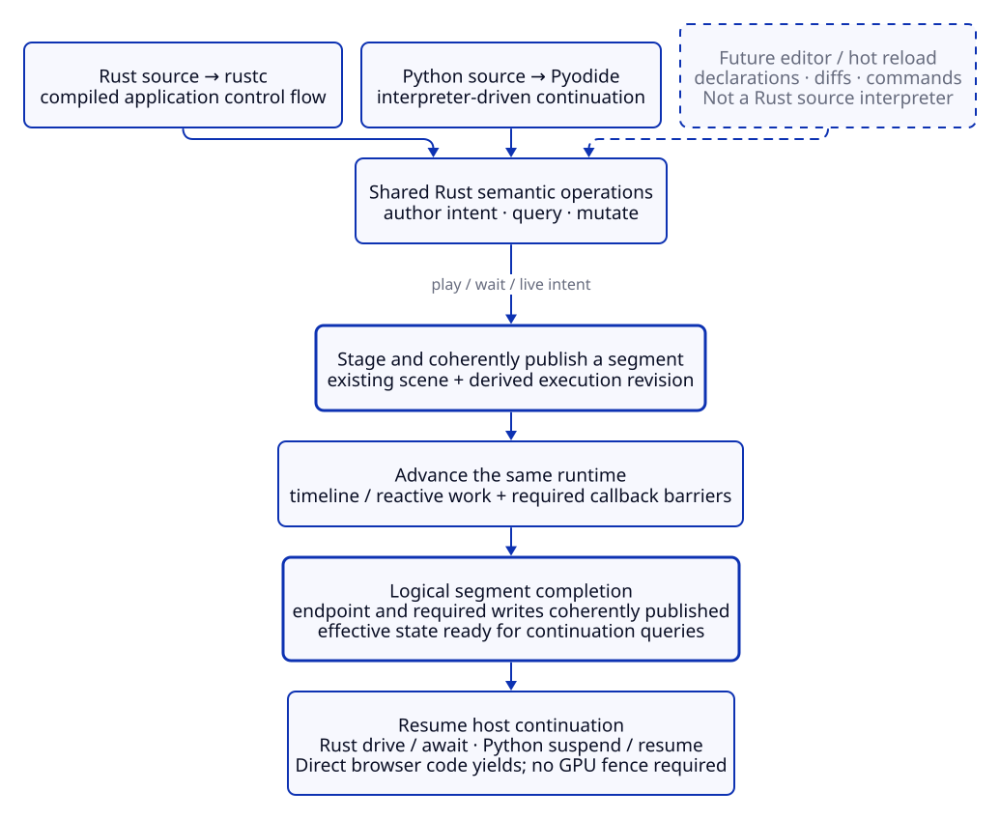
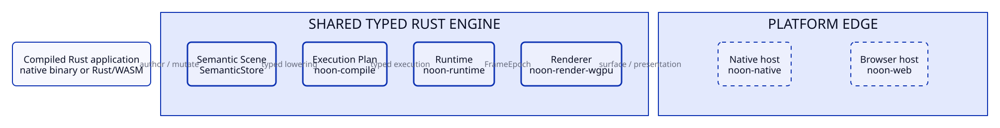
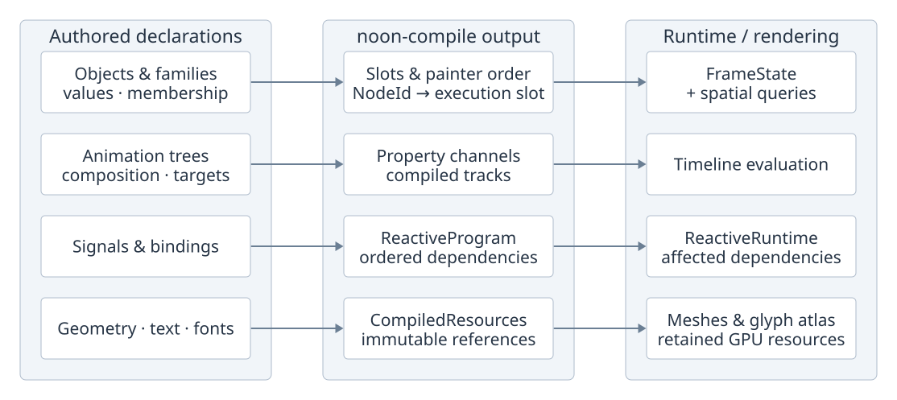
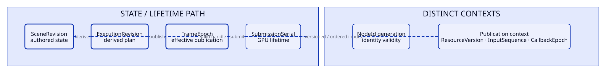
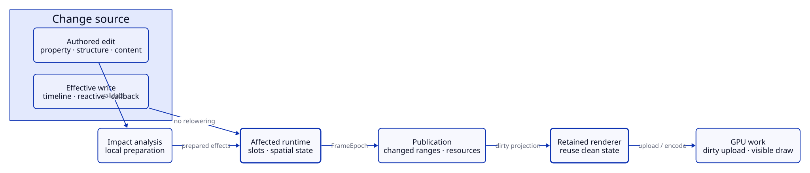
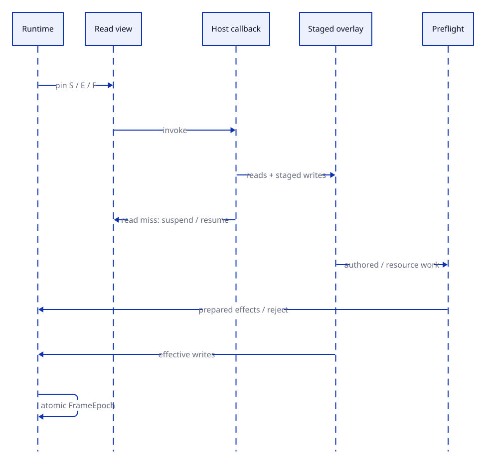
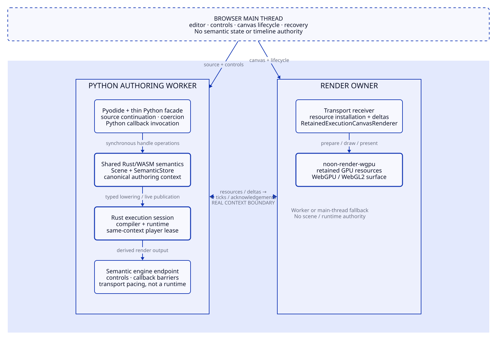
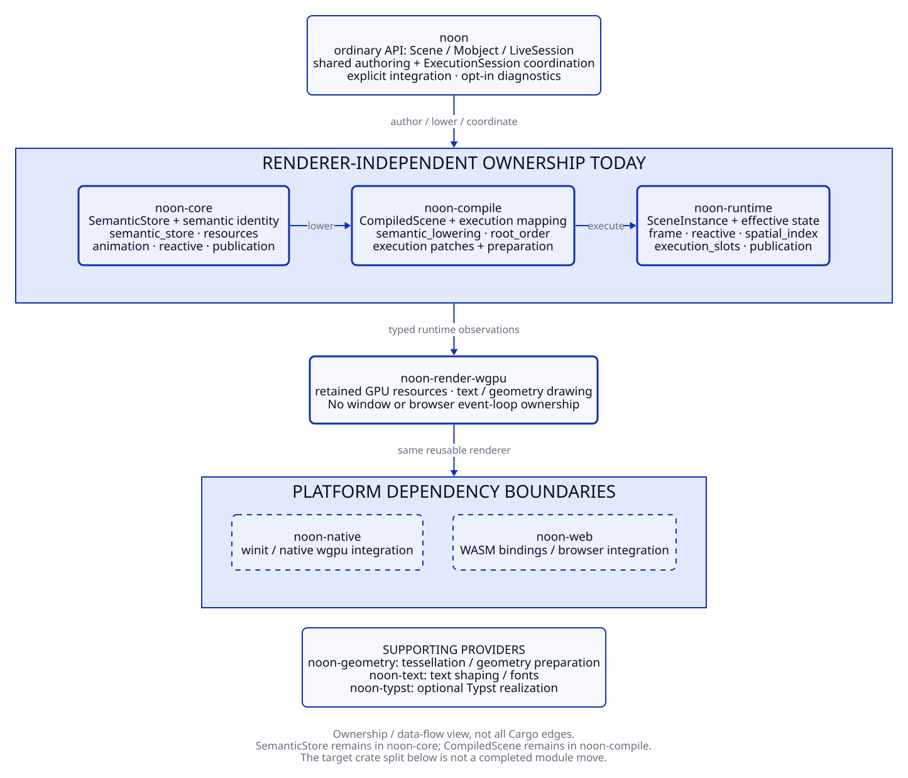

# Noon architecture and roadmap

## Status

This document is the single authoritative architecture and roadmap for Noon.

Noon is a greenfield project. There is no requirement to preserve legacy Noon APIs, internal scene models, wire formats, compatibility aliases, migration adapters, or crate boundaries. If an old abstraction conflicts with this document, remove it rather than adapting around it. Git history is the archive.

Detailed subsystem documents may explain an implementation, test strategy, or compatibility behavior, but they do not define a second architecture or roadmap.

Read this document in three modes:

- **Normative architecture** defines ownership, interfaces, ordering, publication, locality, and lifetime rules.
- **Current implementation** callouts describe where those responsibilities live today without creating a second target architecture.
- **Roadmap status** is intentionally coarse; mutable task inventories and final qualification evidence live in GitHub issues, primarily the Phase A umbrella.

---

## 1. Product target

Noon is a high-performance animation and interactive graphics system with:

- a first-class idiomatic Rust authoring API that can run end-to-end in a native Rust process;
- the same Rust-authored scene semantics runnable as WASM in a browser without changing the engine architecture;
- a built-in renderer/runtime shared by native and web targets;
- Manim-compatible Python authoring for supported common 2D behavior as a wrapper over shared Rust semantics;
- optional future JavaScript/TypeScript authoring as another wrapper over shared Rust semantics;
- a live-scene programming model in which script commands, deterministic playback, native input/reactive behavior, editor actions and explicit host callbacks operate on the same semantic scene rather than separate interactive/script scene engines;
- deterministic offline and realtime execution wherever semantics are deterministic;
- native reactive interaction without requiring Python on the frame path;
- explicit support for arbitrary host-language callbacks when user code genuinely requires them;
- retained, incremental GPU rendering that scales with changed and visible work rather than total scene size;
- aggressive data-oriented execution/render specialization below the semantic layer without exposing a general-purpose ECS, game-engine scheduler or renderer scene graph as authored truth.

The authoring experience should feel like one continuously live scene. The implementation is deliberately not one continuously traversed host-language object graph: static, timeline, native-reactive and host-dynamic behavior are separated and specialized below the semantic boundary so large mostly-static scenes do not inherit the cost of their most dynamic feature.

### Host-language execution invariant

Noon unifies **scene semantics and engine execution**, not source-language execution.

Rust, Python and future frontends are allowed to have fundamentally different host execution models:



[D2 source](diagrams/host-continuation.d2).

A Rust application is ahead-of-time compiled. It may create, query and mutate a live Noon scene at runtime through code paths that were compiled ahead of time, but the live-scene model does not imply that arbitrary new Rust source can be interpreted inside the running process. Arbitrary Rust source changes require an explicit mechanism such as recompilation/hot reload, a plugin boundary, or a separate runtime-editable declarative language.

Python may remain an interpreter-driven sequential authoring continuation. It may issue semantic operations, wait for a segment-completion barrier, inspect the resulting live state, execute more arbitrary Python, and then issue additional semantic operations. That is a host-language behavior, not a second scene/runtime architecture.

Editor, hot-reload and future live-design inputs may be declarative or command-oriented. They converge on the same semantic mutation vocabulary rather than pretending to execute as Rust source.

The shared contract is therefore:

```text
host-language execution
        |
        v
shared Rust semantic operations
        |
        v
Semantic Scene
        |
  incremental lowering
        |
        v
Execution Plan revision
        |
        v
Runtime -> Renderer
```

The Semantic Scene remains alive and authoritative across execution-plan revisions. An Execution Plan is a derived, replaceable specialization of the currently published semantics; it is not a compiled representation of the entire future host program.

### Direct Rust execution invariant

Native Rust and Rust compiled to WASM use the same typed engine path; only the platform shell changes:



[D2 source](diagrams/direct-execution-hosts.d2).

The shared path is `Rust API -> Semantic Scene -> Execution Plan -> Runtime -> Renderer`. When those layers share one process or one WASM execution context, every boundary is typed and in memory.

#### Native host

A native Rust application can author, lower, execute, and render without Python, JavaScript, WASM, a browser runtime, JSON, serialization/deserialization, or a host-language bridge between engine layers. `noon-native` owns window/event-loop, surface, input, acquire/submit/present, and recovery mechanics at the platform edge.

#### Browser/WASM host

A Rust application compiled to WASM uses the same semantic, compiler, runtime, and renderer responsibilities in one WASM context. JavaScript may bootstrap the module, supply the canvas, and provide browser lifecycle glue, but it does not receive and re-send scene/runtime state between Rust layers. A browser target by itself is not a transport boundary.

Serialized transport is justified only at a real external or cross-context boundary, for example the current Python authoring context sending derived resources/deltas to a separate render owner; see section 11.

Python and JavaScript/TypeScript are optional language adaptersPython and JavaScript/TypeScript are optional language adapters over the same Rust semantic operations. They are not required components of the Rust engine, runtime, or renderer.

Manim Community v0.21.x is the compatibility oracle for supported common 2D Python behavior. Compatibility is a semantic/API goal, not an implementation constraint. Noon does not copy Manim's renderer, Python scene engine, internal point representation, or per-frame execution model.

---

## 2. Architecture in one picture


[D2 source](diagrams/overview.d2) · [Domain projections](#domain-projections) · [Revision/lifetime model](#identity-generations-revisions-versions-and-sequences) · [Locality propagation](#runtime-complexity-contract) · [Callback transaction](#ordered-transactional-host-callback-overlay) · [Current crate ownership](#current-implementation-ownership).

**Reading the view.** Solid arrows follow scene/execution data from left to right;
dashed arrows show platform services. The two lower boxes are responsibilities of
each native/browser host, not additional engine stages or two new crates. This is
a component/data view, not a Cargo dependency graph, worker deployment map or a
complete call graph. Live-mutation feedback and callback ordering are expanded in
the focused views below instead of adding long return arrows to this overview.

| Component | Composition and interface |
| --- | --- |
| Authoring | Rust `Scene`/`Mobject` APIs and Python/WASM handles invoke shared semantic operations. Frontends provide language syntax and argument conversion. |
| Semantic scene | `SemanticStore` holds object/family identity, membership, authored transforms/paint, animation trees, signals/updaters and content-resource references. Lowering reads these declarations without replacing their authored identity. |
| Lowering | `noon-compile` derives the execution projection, slot mappings, tracks and resource lookups, and prepares local publication changes. `CompiledScene` labels the main compiled-data handoff; it is not the entire future host program. |
| Runtime + session | `ExecutionSession` coordinates a `SceneInstance`, identity mappings, spatial indexing and segment/callback gates. The instance contains compiled data, evaluation machinery and effective `FrameState`. |
| Renderer | `noon-render-wgpu` consumes published state and changes while retaining instance buffers, geometry meshes, glyph resources and painter-ordered draw work. |

**The publication interface.** `FrameEpoch + changes` abbreviates the
`RendererPublication` boundary: a borrowed frame, accumulated changes, painter
order and immutable resource lookups in direct Rust execution. `FrameEpoch`
identifies a coherent published effective state and references its compatible
`SceneRevision`/`ExecutionRevision`; it is neither the delta payload itself nor an
extra processing stage. A genuine Python worker boundary transports derived
output instead. The direct native and single-context WASM paths remain typed
in-process.

**Platform integration.** The host loop supplies normalized input and frame
wake/tick delivery; the runtime retains authored-time and completion policy. The
surface adapter supplies device/surface access and handles acquisition,
submission, presentation and recovery. These are two aspects of the same host
integration (`noon-native`, or `noon-web` plus browser glue). Their placement
beneath runtime and renderer expresses the service connection, not ownership of
engine state. Actual worker placement is shown in [Browser topology](#11-browser-topology).

**Why these boundaries exist.** Authored structure preserves identities and
relationships while lowering selects an execution representation. Active drivers
can update effective values without rewriting authored declarations every frame;
rendering can reuse geometry/text residency when only properties change.
Persistent edits still pass through staged semantic preparation and coherent
publication. This separates language ergonomics, execution dependencies and GPU
lifetime without turning each representation into another authoring model.

There are four engine layers and exactly one authority at each layer:

1. **Semantic Scene** — what the program means.
2. **Execution Plan** — the cheapest representation that preserves that meaning.
3. **Runtime** — the current execution state.
4. **Renderer** — a projection of runtime state into retained GPU resources and draw work.

Platform hosts are integration shells around those layers. They own window/canvas/surface/event-loop/presentation mechanics, not semantic or runtime truth.

The Rust public API is the first-class native authoring API for these layers. Python and future JS/TS adapt language syntax and host callbacks onto the same Rust semantic operations; they do not define separate engine layers. This shared semantic boundary does not require the host languages above it to share a source-code execution mechanism.

Serialization is not a fifth scene model. It is an optional codec around one of these representations for explicit external boundaries such as export/import, debugging, tests, persistence, or unavoidable cross-context transport.

**Normal in-process engine boundaries are typed Rust boundaries.** `Rust API -> Semantic Scene -> Execution Plan -> Runtime -> Renderer` must not serialize to JSON or any other wire representation as part of ordinary native authoring, lowering, execution, mutation, or rendering. The same rule applies when the Rust engine is compiled to WASM and all layers execute in one browser context.

### Live-session control plane

A continuously live authoring experience requires coordination, but coordination is not another state authority. `ExecutionSession`/`LiveProgram` may order script continuations, wake/sleep, input delivery, callback barriers, revision checks, and publication receipts while semantic truth stays in the Semantic Scene and effective time-varying truth stays in the Runtime.

The [host-continuation view](#host-language-execution-invariant) shows how different host execution models converge on the same logical completion contract. The [live-publication view](#effective-driver-writes-vs-authored-semantic-mutations) shows how staged authored/effective work becomes one coherent publication, and the [callback transaction view](#ordered-transactional-host-callback-overlay) shows the ordered host barrier. These focused views replace a separate control-plane diagram that otherwise duplicated the same relationships.

`play()`/`wait()`-class operations are logical segment-completion barriers, not necessarily blocking function calls and not exclusive interaction modes. Python may suspend its authoring worker; native Rust may drive/await compiled control flow; browser/WASM code yields rather than blocking the event loop.

---

## 3. Semantic Scene---

## 3. Semantic Scene

The Semantic Scene is the only authored scene model.

It is mutable, hierarchical, language-neutral, and expressive enough to represent author intent before optimization.

It owns:

- stable generational node identity;
- detached versus scene-owned objects;
- source identity for hot reload/reconciliation;
- content: geometry, text, images, future meshes and other resources;
- high-precision semantic transforms and styles;
- family/group membership and ordering, including aliasing where Manim semantics require it;
- bounds and layout semantics;
- object lifecycle and scene membership;
- target-state animation semantics;
- animation trees, options, defaults, composition and scheduling intent;
- signals, trackers, bindings and derived expressions;
- updater and event registrations;
- host callback slots;
- camera semantics;
- mutations that change authored structure or properties.

Language wrappers hold stable handles into this scene. They do not own a parallel scene representation.

### Required semantic identity model

Use one scene-global generational `NodeId` (or equivalent) for semantic objects/families. Execution indices, GPU indices, resource handles and transport IDs are derived identities and must never become semantic authority.

### Required value model

Semantic values must not be constrained by the current 2D/f32 renderer. The semantic layer should use the representation needed by the product direction, including 3D-capable/high-precision transforms where appropriate, and lower explicitly to compact execution/render values.

Do not maintain permanent parallel `legacy` and `semantic` transform/style/object models.

### Authored/base state and effective runtime state

The Semantic Scene owns **authored/base state**: the persistent authored value, declaration, relationship or resource reference from which execution is derived.

The Runtime owns the **effective state at a published frame epoch**: the current value after timeline interpolation, native reactive evaluation, host/updater effects and other active drivers have been applied according to their semantics.

Language compatibility getters that ask for the current live value normally observe the latest coherent effective state, not a stale authored/base value. An explicit authored/base-state inspection API may exist when useful, but it is a different query.

Active timeline/reactive/host/editor drivers normally write **effective runtime state**, not authored/base state. Such writes may advance `FrameEpoch` and renderer/spatial state without creating a new `SceneRevision` or requiring semantic relowering. A driver write becomes an authored semantic mutation only when the semantic operation itself is persistent/structural or when compatibility/product semantics explicitly reconcile a resulting effective value back into authored state.

When animation/updater completion semantics require an effective final value to persist after the driver is released, that persistent result is reconciled into authored/base state through the normal mutation contract and coherent publication path. A conforming frontend must therefore not disagree about a current getter merely because authored and effective representations live in different layers.

### Semantic structure is not execution structure

Semantic families, object hierarchy and aliases exist because they are observable authoring semantics. They must not be forced to double as the optimal execution or render hierarchy.

The compiler may factor compatible high-fanout behavior into derived execution structures such as shared transform/style domains, instance groups or other compact representations when observable semantics are preserved. A semantic family and a derived execution/render group are not required to be one-to-one. Aliasing, conflicting drivers, ordering or other observable semantics may prevent factoring and require explicit member work.

Compact fan-out does not imply that every downstream operation becomes O(1). If an observable consumer genuinely needs per-leaf materialization, for example world-space bounds or precise hit-test records, work may scale with the affected leaves that must be materialized. Domain split/deoptimization may scale with the size of the affected domain, but it must not silently expand to unrelated scene content.

This is a one-way specialization rule: execution/render structure may be derived from semantic structure, but derived execution/render grouping never becomes authored truth.

---

## 4. Language frontends

High-level behavior is implemented once in shared Rust semantic code.

The frontend contract is semantic, not an assertion that all languages execute source code the same way. Frontends converge when they invoke the same semantic operations and observe the same resulting behavior.

### Rust public API

Rust authoring is first-class, not a wrapper around Python, JavaScript, WASM, JSON, or a transport model.

The idiomatic Rust API calls shared semantic operations directly and must support normal `Scene`, `Mobject`, animation, signal/reactive, query, mutation, lowering, execution, and rendering workflows entirely inside the Rust environment.

A native Rust application must be able to build and render a Noon scene without initializing any language host or serialization subsystem.

A Rust application compiled to WASM must be able to build and render the same Noon scene semantics to a browser canvas without serializing between in-process engine layers. Browser bootstrap code is platform integration, not an authoring or engine dependency.

Rust runtime mutability does not imply runtime interpretation of arbitrary Rust source. New behavior introduced by source changes requires ordinary recompilation/hot reload or another explicit dynamic mechanism. Editor/live-scene mutations should therefore target semantic operations rather than inventing a Rust-source interpreter requirement.

### Python may own

- Manim-compatible class hierarchy and method signatures;
- Python argument normalization and iterable/vector conversion;
- Python callable identity and callback invocation;
- Scene subclass discovery and sequential authoring control flow;
- Python-appropriate exceptions and wrapper metadata.

### Python must not own

- object ID or painter-order allocation;
- semantic object state;
- scene membership/lifecycle;
- family traversal or ordering semantics;
- layout/bounds calculations;
- target-state evaluation;
- animation timing/scheduling/interpolation;
- signal evaluation;
- transaction rollback state;
- retained execution or renderer state;
- a second retained-text scene;
- a second renderer/runtime model.

The desired shape is a thin proxy API:

```python
class Mobject:
    def shift(self, value):
        self._handle.shift(value)
        return self

class Scene:
    def add(self, *objects):
        self._handle.add([x._handle for x in objects])
```

The Rust public API calls the same semantic operations directly, without any wrapper or serialization hop.

Thin does not mean one cross-language call per scalar property access. Frontends may batch construction/mutation/query operations and host-callback read/write sets where that preserves observable semantics. Large immutable content should cross a real language/context boundary as a resource payload/handle once, not be repeatedly reconstructed as scene-shaped messages.

### Script continuation semantics

Sequential authoring is allowed to depend on completed runtime state. `play()`/`wait()`-class operations therefore establish a logical segment-completion barrier:

See the [host-continuation diagram](#host-language-execution-invariant) ([D2 source](diagrams/host-continuation.d2)): author intent, stage/publish a segment, advance the same runtime, then resume only after logical completion.

The host mechanism used to wait is target-specific: a Python worker may block/suspend an interpreter continuation, native Rust may drive/await through compiled control flow, and browser/WASM must yield/await without blocking browser frame/input servicing. These mechanisms need semantic equivalence at the barrier; they do not need identical host-language execution machinery.

A segment is complete when:

- the requested authored-time boundary has been reached;
- every required ordered callback/updater dependency through that boundary has completed;
- resulting authored semantic mutations and effective driver writes, together with any required incremental lowering/preparation, runtime/spatial changes and renderer-facing delta, have been coherently published;
- the resulting effective state is queryable by the resumed authoring continuation.

Completion normally does **not** require waiting for GPU retirement/fence completion or for an old resource version to be physically freed. After the barrier, live-value queries observe the coherent effective state defined above.

This continuation protocol must not require a host interpreter while a deterministic segment is running unless host-dynamic behavior is actually scheduled.

### Paired executable examples

For significant supported common semantics, maintain equivalent executable Rust and Python examples.

The examples have different jobs:

- the Rust example is the direct first-class product proof;
- the Python example proves the language wrapper reaches equivalent shared Rust semantics;
- both should exercise the normal lowering/runtime/renderer path appropriate to their target;
- target bootstrap and host control flow may differ, but scene semantics should be equivalent and reusable;
- cross-language qualification must not depend on serializing migration-era scene documents as the ordinary comparison mechanism.

When a feature is supported in both Rust and Python, implementation is not complete merely because one frontend can demonstrate it.

---

## 5. Analysis and lowering

The compiler lowers the Semantic Scene into an Execution Plan. This is **scene lowering/specialization**, not Rust source compilation and not execution of the future host program.

For Rust, whether native or WASM, this is an ordinary typed in-memory Rust transformation when the compiler and runtime live in the same execution context. The Semantic Scene is not serialized into a wire document and reparsed by the compiler.

Lowering is allowed to discard or refactor authoring structure whenever doing so preserves observable behavior.

### Domain projections



[D2 source](diagrams/domain-projection.d2).

Each row follows a data domain across lowering and its consumers. These are
projections, not four independent pipelines or a function-call sequence: timeline
and reactive results contribute to the same effective frame; the frame also
references content and participates in spatial/painter-order queries. Geometry
meshes and glyph residency are prepared downstream by rendering, not baked into
`SemanticStore`. `CompiledResources` retains the typed resource projection.
Arbitrary host callback slots use the ordered barrier protocol in section 9 rather
than being assumed to execute inside the native reactive graph.

The optimizer classifies dependencies/properties, not whole scenes, into these execution classes:

### Immutable

No runtime change is possible.

Examples: static geometry, constant styles, immutable resource topology.

Compile/cache/pack these completely.

### Timeline

The value is predetermined by authored time.

Examples: ordinary transforms, fades, reveals, deterministic composition.

Lower these to explicit tracks, prepared morph/reveal data, or GPU-evaluable parameters.

### Native reactive

The value changes at runtime, but Noon understands the dependency graph.

Examples: `ValueTracker`, pointer position, viewport size, property bindings, built-in constraints and derived expressions.

Evaluate only the dirty dependency closure.

#### Optional host-expression capture

Capture is an optional frontend translation/lowering optimization, not another execution class, runtime, or Phase A exit requirement. Its result belongs to the existing immutable, timeline, or native-reactive class according to its dependencies. Reuse shared typed semantic expressions and reactive lowering rather than introducing a frontend-owned expression graph or interpreter.

A frontend may offer a constrained host-expression subset that can be captured or traced into Noon-owned expression/reactive IR. Once successfully lowered, that behavior is native execution and does not require the host interpreter on the frame path.

Examples may include pure arithmetic over trackers/signals, supported vector operations, property bindings, and other expressions whose dependencies and side-effect semantics Noon can represent explicitly. Captured closure values and guards require explicit validity/invalidation rules; mutable host state cannot silently become a frozen constant.

Tracing/capture is a frontend translation mechanism, not a new semantic authority. It must preserve observable semantics and must not speculatively execute arbitrary host code in a way that duplicates or hides external side effects. An implementation may require an explicit traceable API/subset where transparent tracing would be unsafe.

If a host expression cannot be represented faithfully, it remains **Host dynamic** rather than being silently approximated. Unsupported capture must be detected before committing semantic mutations or running effectful host code; falling back must not replay an arbitrary callback or duplicate its side effects. An explicit capture-only API may reject unsupported input, while a callback API may retain the original host-dynamic behavior and ordering. A failed trace must not poison unrelated static/timeline/native-reactive work.

### Host dynamic

Correct behavior requires arbitrary host-language execution.

Examples: an updater containing arbitrary Python control flow or an event handler that calls user Python code with effects Noon cannot model.

Represent this explicitly as host callback slots. A few host-dynamic dependencies must not make unrelated static/timeline/native-reactive content dynamic.

Execution classification is an implementation choice, not permission to reorder observable semantic updater execution. If authored/compatibility updater order is `native A -> host B -> native C`, the execution plan must preserve that order, for example as native regions separated by a host-callback barrier. Independent work may be fused, parallelized or reordered only when the compiler/runtime can prove that the difference is unobservable.

### Data-oriented specialization rule

Noon may borrow ECS/data-oriented techniques below lowering without adopting ECS as the authored scene model.

Execution may use dense arrays, structure-of-arrays layouts, sparse identity maps, compact change revisions, specialized queues and content-specific immutable resource arenas. The layout is chosen for evaluation/locality, not for authoring ergonomics.

A derived execution slot may therefore expose transform/style/bounds/resource/timeline/reactive fields independently even though those values came from one semantic object. Conversely, compatible semantic fan-out may be represented by one shared execution domain when that avoids materializing thousands of equivalent child updates.

There is no public requirement that a semantic `Mobject` map to one ECS entity, one GPU object, one draw call or one renderer record.

---

## 6. Execution Plan

The Execution Plan is renderer-independent, compact, validated execution data.

It may contain:

- stable execution slots mapped from semantic identities;
- dense/specialized mutable-property storage and change-revision metadata;
- immutable content/resource references;
- resolved timeline channels and event schedules;
- precomputed geometry/morph/reveal plans;
- native reactive bytecode/graphs, including successfully captured/traceable host expressions;
- mutable property slots;
- ordered updater/evaluation regions with explicit host-callback barriers where needed;
- host callback descriptors;
- event subscriptions;
- derived transform/style/instance domains for compact high-fanout execution where semantics permit;
- invalidation metadata;
- bounds/spatial-index data needed by execution.

It is not required to preserve the Semantic Scene's ergonomic hierarchy.

Execution grouping is derived and disposable. It is legal for the compiler to split one semantic family across execution groups or combine compatible semantic leaves under one execution transform/instance domain. Such grouping must preserve identity mapping, ordering, hit-testing and mutation semantics and must be invalidated/reformed locally when the assumptions enabling the specialization stop holding.

The Execution Plan is not a frozen representation of the entire host-language program. Sequential Python authoring, editor actions, compiled Rust event handlers, hot reload and other producers may publish later semantic revisions that require a new or incrementally changed execution projection.

Replaceable does not mean rebuilt for each operation. Ordinary changes use impact-local preparation and atomic semantic/execution publication, preserving compatible semantic identity, runtime time/state, active drivers and retained resources. Revision transitions occur at an atomic safe point and must preserve, or explicitly reject before publication, any active execution segment, pending callback token and pending publication receipt. The previous coherent revision remains usable if preparation fails; effective-only driver updates continue to advance frame state without semantic relowering. Plan replacement does not authorize resetting the live runtime or reconstructing unrelated scene state.

Execution-plan ownership remains below the semantic store: `noon-core` owns shared semantic identity/store and renderer-independent contracts, while `noon-compile` owns `CompiledScene` and lowering/specialization. Authoring compatibility helpers belong in the public/frontend layers, not in either shared engine contract merely for convenience.

---

## 7. Runtime

A runtime instance owns current execution state:

- playhead and timeline cursors;
- current effective mutable property values;
- signal/input values;
- dirty/invalidation sets and/or per-slot change revisions;
- lifecycle/presence state;
- spatial-index state;
- host callback requests/results;
- the current `SceneRevision`/`ExecutionRevision` relationship;
- `FrameEpoch` and other sequencing state needed for coherent publication;
- renderer-facing change sets.

Static clean content should disappear from ordinary per-frame CPU work.

### Fixed semantic phases, specialized implementation

Noon has a small fixed execution protocol rather than a public arbitrary system scheduler. A representative frame/publication cycle is:

```text
1. ingress
   sampled pointer/viewport/control state + ordered discrete events

2. timeline evaluation
   evaluate authored-time progress and deterministic active channels

3. ordered dynamic evaluation
   preserve semantic updater/effect order
   native regions may be separated by required host-callback barriers

4. collect a StagedUpdateBatch
   effective driver writes remain runtime/effective changes
   authored semantic mutations remain persistent/structural changes
   both remain unpublished until the same coherent barrier

5. validate + prepare
   validate authored semantic mutations and perform impact analysis
   incrementally lower/prepare only when semantic/execution structure changes
   prepare effective runtime/spatial/resource changes without semantic relowering when not required

6. atomic publication barrier
   publish FrameEpoch F referencing:
     SceneRevision S
     ExecutionRevision E
   plus the coherent effective Runtime state,
   spatial/index changes and renderer-facing delta

7. visibility + renderer preparation
   consume the published FrameEpoch and produce candidate-sized/dirty work

8. GPU upload/encode/submit/present
```

The implementation may fuse, skip, parallelize or pipeline stages when observable ordering and revision/coherence rules remain identical. The phase model is a semantic ordering/publication contract, not permission to expose a general-purpose game-engine scheduler.

There is no global rule that all native-reactive work runs before all host-dynamic work. Classification controls *how* an ordered region executes; semantic dependency/updater order controls *when* it executes. A successfully traceable host expression belongs to a native region after lowering; an opaque callback remains a host barrier.

`FrameEpoch` is the unit of coherent effective publication. Each published frame epoch references the exact semantic and execution revisions from which its effective state is derived:

```text
FrameEpoch N
    SceneRevision S
    ExecutionRevision E

FrameEpoch N+1
    SceneRevision S       // may be unchanged
    ExecutionRevision E   // may be unchanged
```

Only a committed authored semantic mutation creates a new `SceneRevision`. Only a changed derived execution projection creates a new `ExecutionRevision`. Ordinary timeline interpolation, native reactive evaluation and host updater driver writes may therefore advance `FrameEpoch` while both revisions remain unchanged. This distinction is required so per-frame effective behavior does not imply semantic commits or relowering.

When a staged batch does contain authored semantic mutation, that mutation and its required derived lowering/preparation are one logical publication. If validation/lowering/resource preparation required for the operation fails, no new live `SceneRevision`/compatible `ExecutionRevision` is published. Async preparation normally remains staged until coherent publication is possible. A feature may explicitly expose a semantic `pending` state when that state itself is part of the authored/product semantics, but the previous executable/resource version remains active until the pending operation can publish coherently.

Timeline and interaction are not mutually exclusive modes. Native input/reactive changes may be processed while a timeline segment is running. A host `play()` call/await merely waits for the logical segment completion contract before its sequential authoring continuation resumes.

### Settling and wakeup

A runtime with no active timeline work, no dirty reactive dependency, no pending event, no required host callback and no pending renderer publication should settle/sleep rather than continuously tick.

Relevant input, a timeline boundary, a host result, an async resource result or an explicit authoring/editor mutation wakes it. Paused interaction may therefore be responsive without advancing authored timeline time or burning continuous CPU when nothing changes.

### Time and determinism

Noon distinguishes clocks/sequences that must not be conflated:

- **authored/simulation time** — the time used by authored timelines, deterministic playback and compatibility updater `dt`;
- **wall/presentation time** — host elapsed time used to schedule realtime presentation, not semantic truth by default;
- **input sequence/timestamps** — ordered external event identity/timing used for interaction and optional replay;
- **GPU submission/presentation time** — backend scheduling/lifetime information, not authored scene time.

Compatibility updater `dt` is defined from authored/simulation-time advancement. A paused scene may process pointer/keyboard/editor input while authored `dt == 0`. Behavior that explicitly reads wall time, network time or another external clock is externally timed/non-deterministic unless the source is recorded and replayed by an explicit policy.

Replay classification applies to all externally supplied behavior that can affect results, including pointer/keyboard input, editor manipulation, host callbacks, async/network results and other external data. Recorded native input/event streams may be replayable even though their original occurrence was nondeterministic.

### Identity generations, revisions, versions and sequences

Identity validity, authored/execution revisioning, effective publication, external event ordering, and GPU lifetime are distinct domains. They must not collapse into one ambiguous global generation counter:



[D2 source](diagrams/revision-publication-lifetime.d2).

| Domain | Meaning |
| --- | --- |
| `NodeId` / `ExecutionSlotId` generation | Identity validity across slot reuse; stale handles cannot alias replacements. |
| `SceneRevision` | One coherently committed authored semantic-scene revision. |
| `ExecutionRevision` | One compatible derived execution projection. |
| `FrameEpoch` | One coherent effective runtime/presentation publication referencing a scene/execution revision pair. |
| `ResourceVersion` | Immutable content/resource replacement version. |
| `InputSequence` | Ordered external event sequence. |
| `CallbackEpoch` | Ordered callback/evaluation request/result context. |
| `SubmissionSerial` | GPU submission/fence/retirement ordering. |

Values from different domains are not directly comparable merely because they are integers. Async/callback/resource results carry the exact identity/revision/version context needed to prove applicability. Consumers may remember the last relevant revision/version rather than relying on global dirty-bit clearing; late results must be rejected or reconciled deterministically instead of overwriting newer state.

### Runtime complexity contract
### Runtime complexity contract

```text
clean paused/static frame       ~ O(0) meaningful CPU work
timeline work                   ~ O(events crossed + active CPU channels)
ordered updater/reactive work   ~ O(affected ordered regions + required host barriers)
effective driver write          ~ O(affected runtime slots/domains + observable consumers)
authored property edit          ~ O(affected semantic/execution slots/domains)
structural edit                 ~ O(local dependencies + required relowering)
transaction preflight           ~ O(transaction + affected dependency/relationship closure)
preflight temporary memory      ~ O(transaction + affected dependency/relationship closure)
high-fanout domain work         ~ O(changed domains + affected leaves actually materialized)
visibility query                ~ O(index query + candidates)
render publication/preparation  ~ O(dirty resident state + visible projection)
GPU upload                      ~ O(changed ranges/resources)
draw submission                 ~ O(visible batches/instances)
host bridge calls/bytes         ~ O(host working set + returned staged updates/resource payloads)
resource regeneration           ~ O(actual resource changes)
resource retirement             ~ O(actual retired changed resources)
```

The locality contract covers reads, validation/preflight, temporary allocations, writes, lowering, spatial work, renderer preparation and transport—not only the final committed write count. No feature may hide an O(total-scene), O(total-family) or O(total-resource) scan behind an operation whose final mutation is local unless the semantics genuinely require that wider work.

A deliberate maintenance barrier is a separate, explicit exception to ordinary local-edit complexity. Controlled compaction/repacking/rebuild may be O(live state) or O(size of an explicitly affected domain) when scheduled as a named maintenance/generation barrier with instrumentation and coherent handle/revision rules. It must not occur unpredictably on an ordinary local edit and must not be used to justify routine whole-scene fallback.

Arbitrary source-language re-execution is another explicit exception: Noon cannot promise sublinear execution of arbitrary Python/Rust/JS program logic. Hot-reload reconciliation must still ensure that unchanged semantic/execution/runtime/renderer state is preserved and that re-executed authoring work does not imply whole-scene lowering or GPU replacement.

The expected propagation of a local change is therefore explicit:



[D2 source](diagrams/locality-propagation.d2). Effective-only driver writes bypass authored relowering and join at affected runtime state. Authored structural/resource changes perform only the required local preparation. Unrelated semantic identities, execution slots, retained resources, and GPU ranges remain untouched unless observable semantics genuinely require wider materialization.

---

## 8. Mutations

Persistent authored/live structural and property changes use one semantic mutation vocabulary and atomic transaction model.

Conceptually:

```text
MutationTransaction
  SetProperty
  SetSignal
  ReplaceContent
  AddNode
  RemoveNode
  AddMember / RemoveMember / ReorderMember
  AddAnimation / RemoveAnimation
  ChangeSubscription
```

A semantic transaction is validated before commit.

Each operation has an impact class so the compiler/runtime can perform the minimum required work:

```text
persistent color/translation change -> semantic property slot/domain update
signal declaration/base change       -> semantic/reactive impact
path/content replacement             -> prepare + replace affected resource
add/remove/reparent                  -> local structural update + bounded relowering
large semantic rewrite               -> wider relowering only when genuinely required
```

Host callbacks, editor actions, graph topology updates and hot reload should reuse this machinery for authored semantic changes rather than inventing separate semantic patch systems.

### Effective driver writes vs authored semantic mutations

Ordered runtime evaluation may produce two different classes of staged output and the architecture must not conflate them:


[D2 source](diagrams/live-publication.d2).

This is the publication contract for supported operations, not a claim that every mutation kind in the roadmap is implemented. Today `noon::ExecutionSession` coordinates preparation and commit; `noon-compile` owns local lowering and root-relative membership/painter-order preparation, and `noon-runtime` owns effective execution. A failed preparation leaves the previous coherent publication live.

Both classes participate in the same semantic updater order, transactional overlay and coherent `FrameEpoch` publication barrier, but they have different ownership and invalidation costs.

For example, `m.shift(...)` executed by an active updater normally writes that updater/driver's effective transform for the current execution state; it does not automatically rewrite the authored/base transform or relower the semantic scene every frame. By contrast, structural operations such as `scene.add(...)`, durable membership/subscription topology changes and other explicitly persistent semantic operations use the semantic mutation path. A driver release/completion may reconcile its effective value into authored/base state when compatibility semantics require persistence.

The exact classification is semantic, not purely syntactic: the same frontend method name may represent ordinary authoring outside active execution and an effective driver write when invoked inside an updater. The shared Rust semantic/runtime layer owns that distinction so frontends cannot diverge.

### Atomic semantic/execution publication

For a staged batch containing authored semantic mutations, transaction atomicity extends through the derived work required to make the transaction executable. Validation, impact analysis, incremental lowering and any required synchronous preparation occur against staged state before the new semantic revision becomes live.

The publication barrier always publishes one coherent `FrameEpoch`. That epoch references the compatible `SceneRevision`/`ExecutionRevision` and includes the resulting effective runtime state, spatial/index changes and renderer-facing delta. Effective-only batches may publish a new `FrameEpoch` with unchanged semantic/execution revisions. A failed semantic preparation publishes no new semantic/execution revision and cannot leave the live frame referencing an incompatible pair.

Async content/resource work either remains staged until coherent publication is possible, or exposes an explicit semantic pending state whose old executable/resource version remains live. There is no accidental half-published Semantic Scene paired with an older incompatible Execution Plan.

### Structural publication barrier

Structural mutation must not invalidate the execution revision currently being traversed. Host callbacks, native/editor producers and hot reload may enqueue structural changes during an evaluation epoch, but those changes become visible only through the validated atomic publication barrier with deterministic ordering.

Property/value changes may have specialized effective-driver fast paths when their ownership/ordering semantics make that safe. Structural add/remove/reparent/reorder, subscription topology and other changes that alter traversal/dependency shape use the shared semantic transaction/publication contract rather than mutating containers beneath an active iterator.

### Transaction-local/provisional identity

Arbitrary structural callbacks require read-after-write behavior for objects that do not yet exist in the published Semantic Scene. A staged transaction must therefore support an equivalent of transaction-local/provisional identity.

Conceptually:

```text
reserve provisional handle / identity
AddNode(provisional)
SetProperty(provisional, ...)
AddMember(..., provisional, ...)
read provisional state through callback overlay
...
validate + lower/prepare
atomic publish or abort
```

The exact representation may be a reserved generational `NodeId`, a transaction-local token that is promoted at commit, or another implementation with equivalent semantics. Before publication it is visible only through the staging/callback context, cannot alias a published node, and cannot leak into unrelated runtime/renderer state. On successful commit it resolves to a stable published semantic identity without changing the host-visible logical object; on abort, any purely provisional identity/resource is invalidated and cannot later become observable as a live node.

This capability also lets a callback construct, mutate, inspect and then attach a new object coherently without half-publishing it between operations.

A failed transaction publishes nothing. Provisional handles/resources created only for a failed transaction must not remain observable as live semantic state.

---

## 9. Host callbacks and interaction

Native interaction is preferred when semantics are known. Traceable host expressions should lower to native execution when their semantics can be captured faithfully. Arbitrary host behavior remains a supported first-class execution class and explicit fallback.

### Native interaction path

Ordinary pointer/keyboard/viewport/control behavior should be expressible as runtime inputs feeding the same native reactive graph as other signals:

```text
platform input
     |
normalized sampled state / ordered events
     |
native signals + ordered reactive/updater evaluation
     |
mutable execution slots/domains
     |
retained renderer
```

When behavior is fully native, including behavior successfully captured into native expression/reactive IR, no Python/JS host callback phase is required after authoring.

### Ordered transactional host callback overlay

Arbitrary host callbacks need imperative read-after-write behavior without forcing one cross-language commit per getter/setter. Host execution participates in the same semantic updater/effect order as native regions.

The ordered callback barrier is a transaction, not a sequence of scalar bridge calls:



[D2 source](diagrams/callback-transaction.d2). The callback invocation is pinned to one coherent scene/execution/frame context. Reads consult pending overlay writes first and then the revision-pinned read view; writes accumulate in one `StagedUpdateBatch` as effective driver writes and/or authored semantic mutations. Fallible semantic/resource preparation completes before the next publication becomes visible.

If compatibility semantics require updater orderIf compatibility semantics require updater order `native A -> Python B -> native C`, callback B observes A's effective writes and C observes B's overlay writes regardless of whether B produced effective driver writes, authored semantic mutations or both. Structural changes still do not mutate the traversal currently being enumerated; their structural visibility follows the staged publication rule.

Do not cross Python/WASM once per property getter/setter. Callback requests should contain or bulk/lazily obtain the host working set needed for the callback phase, and the returned result should be one bounded staged-update/resource transaction. Arbitrary host code must not silently degrade into thousands of synchronous scalar bridge calls per frame.

### Cross-context callback read view

At a genuine worker/process/context boundary, Noon may maintain a **versioned, non-authoritative callback read mirror/cache** containing callback-readable effective state pinned to the relevant `SceneRevision`/`ExecutionRevision`/`FrameEpoch`. It exists only to make coherent host reads efficient; it is never scene or runtime authority.

Callback writes remain in the local staged overlay and are returned as one transaction/update batch. A complete mirror may contain all callback-readable state judged appropriate for that boundary; a partial mirror may cache only likely/read-set state.

A read miss from a partial mirror has explicit semantics:

- if the host/runtime can suspend the current callback invocation at the missing read, it fetches the missing revision-pinned value and resumes that **same invocation**;
- if suspension is unavailable, the callback fails deterministically rather than receiving stale/undefined data;
- automatic restart/replay of the callback is permitted only when that callback is explicitly classified replay-safe/idempotent for the relevant host side effects;
- Noon transaction rollback/atomicity applies to Noon semantic/runtime/resource state, not to arbitrary external host side effects such as file/network I/O, printing or unrelated host-global mutation.

The implementation must therefore never treat arbitrary callback restart as an invisible cache-miss mechanism. Declared read sets, observed-read caching and batched prefetch remain optimizations around the same revision-pinned read semantics.

If no host callback slots exist, playback must not require the host interpreter.

### Input/event semantics

Input semantics distinguish:

- sampled state, where latest value wins for the exact source (pointer position, viewport size, continuous controls);
- discrete ordered events, where occurrences must not collapse (press/release/click/key and similar events).

Paused scenes may react to input without advancing authored timeline time. Input events carry explicit `InputSequence` ordering and, where relevant, timestamps in a defined clock domain.

Ordered discrete-event storage is bounded. A required host-callback stall must not imply unbounded memory growth while discrete events continue arriving. Producers/transports that can be throttled should apply backpressure before the bound is exceeded. For sources that cannot be backpressured, overflow must produce an explicit surfaced overflow/session-fault policy; the implementation must not silently coalesce, reorder or discard required discrete events while claiming preserved semantics. Event classes may be loss-tolerant only when that property is explicit in their semantic definition.

### Driver arbitration

Timeline, native reactive, host callbacks and editor/direct manipulation are distinct property drivers. They must not silently compete through unspecified global last-writer-wins behavior.

The runtime must define acquisition/release/suspension/rebase/cancel rules for conflicting drivers. Exact policy may differ by semantic operation, but ownership and conflict behavior must be explicit, testable and compatible with supported Manim updater/animation behavior.

Animation activation must also define when start/target state is captured. Live mutations before activation cannot be ignored merely because an animation declaration was lowered earlier. Authored animation intent, activation-time state and active execution channels are distinct concepts where semantics require late binding.

### Replay and host latency

Host-dynamic behavior must be classifiable as replayable/deterministic, history-dependent, or externally/non-replayable as needed for seek/offline semantics. The broader replay policy also covers native input/event streams, editor manipulation and external async/network results as described in the time/determinism contract.

Required ordered compatibility callbacks are **non-coalescible by default**. Authored/simulation time cannot advance past a dependency barrier whose required callback result has not completed, because later effective state would otherwise be semantically undefined. Slow required Python therefore causes poor simulation/frame rate, not reordered or missing updater semantics.

While a required host callback is outstanding, presentation may continue showing the last coherent published frame and sampled input may continue coalescing to its latest state. Discrete events remain ordered within the bounded queue/backpressure policy above. Only host work explicitly classified with latest-value/coalescible semantics may be superseded or dropped.

Callback results carry the exact callback/revision context required to prove applicability. A stale result cannot overwrite newer state. Offline execution may wait for required host behavior; realtime presentation may apply the defined stall/backpressure policy, but it cannot advance authored state through a required ordered barrier.

---

## 10. Geometry, text and resources

Semantic content remains high-level where useful; compilation chooses the cheapest retained representation.

Examples:

- simple shapes: analytic/instanced where profitable;
- arbitrary static paths: cached tessellation;
- morphs/reveals: precomputed compatible geometry/arc-length data;
- text: shaped glyph runs and atlas rendering by default;
- text outlines: lazy, only when path-level semantics require them;
- images/meshes: immutable retained resources with localized replacement.

Transform/style/visibility-only changes must not regenerate immutable content.

### Immutable versioned resource rule

Expensive geometry/text/image/mesh realization should be represented as immutable/versioned resources wherever practical. Mutable object state references those resources rather than embedding repeatedly rewritten heavy geometry in ordinary frame state.

Morph lowering may prepare immutable endpoint geometry in a fixed rendering coordinate frame, with a derived render transform separate from the effective semantic transform. This specialization must preserve world-space point correspondence, stroke behavior, channel precedence, and spatial queries. The current screen-space specialization requires finite, safe endpoint geometry and an invertible interpolated scale; unsupported cases retain current-relative evaluation. Independent affine drivers release the fixed frame before taking ownership, and exact morph endpoints restore source/target content without a stale render override. Native execution shares the compiled geometry directly; a genuine worker boundary installs its session-scoped resources once and sends references with per-frame progress, rather than reconstructing or retransmitting paths on each tick.

Installed immutable geometry may carry one-shot preparation hints containing its actual tessellation style and render transform. The renderer resolves and deduplicates its full mesh keys, tessellates eligible paths, and uploads a resident geometry prefix before playback readiness; ordinary frames still use the same authoritative mesh-key lookup and lazy fallback for unsupported or changing inputs. Preparation must not advance or sample the timeline. Scene installation replaces this disposable residency coherently, and the browser suspends animation ticks through preparation and initial presentation, including reruns and renderer transitions.

Replacing persistent semantic content prepares a new `ResourceVersion`, validates it against the relevant semantic/source revision, then publishes the new reference only as part of a coherent semantic/execution publication. Failed or stale preparation leaves the previous live version intact.

Runtime/effective content drivers, where supported for compatibility such as redraw-style behavior, must use an explicit effective resource/publication path rather than implicitly rewriting authored semantic content every frame. They remain subject to resource-version, stale-result and retirement rules, but do not create a `SceneRevision` merely because the effective resource changed.

Async preparation normally remains staged while the old resource/execution version remains active. If a feature deliberately publishes a semantic pending state, that state is explicit and queryable; it does not imply that incomplete resource data has become the active execution representation.

Renderer/GPU lifetime is decoupled from semantic publication: an old resource version may remain physically resident while already-submitted GPU work still references it. Resource retirement occurs only when the relevant `SubmissionSerial`/fence indicates it is safe. New content must not overwrite buffers/resources still referenced by in-flight frames.

Long-running interactive/hot-reload churn must have a bounded reclamation/compaction strategy. Stable/tombstoned execution identities and retained caches are allowed, but memory usage must not grow indefinitely with historical mutations when the corresponding semantic/execution/resource state is no longer live or deliberately cached. Explicit maintenance compaction may use the deliberate maintenance-barrier exception defined above.

Text, Graph, 3D and interaction are features of the same scene/runtime architecture, not separate scene engines.

---

## 11. Browser topology

The browser must support two distinct integration shapes without confusing them.

### Direct Rust/WASM authoring and execution

For a Rust-authored application compiled to WASM, the preferred topology is one typed in-process Rust path:

See the [direct Rust execution diagram](#direct-rust-execution-invariant) ([D2 source](diagrams/direct-execution-hosts.d2)). The same semantic/compiler/runtime/renderer responsibilities execute in a single WASM context; only platform lifecycle crosses into JavaScript.

No transport representation exists between these layers merely because the target is the browser. JavaScript may load the WASM module, provide the canvas, and participate in browser-specific lifecycle glue, but it does not receive and re-send scene or runtime state between the Rust layers.

A `play()`/`wait()` barrier in this topology must not require synchronously blocking the browser main thread. The same logical segment-completion contract may be exposed through async/yielding host mechanics.

### Host-language or multi-worker topology

Arbitrary Python should stay away from the render frame loop. The **current semantic Python path** uses the following placement:



[D2 source](diagrams/python-workers.d2).

The current implementation keeps the semantic context and its existing compiler/runtime session together in the authoring worker. [`semantic-engine-endpoint.js`](../web/semantic-engine-endpoint.js) leases the context's existing player through `createExecutionPlayer` / `returnExecutionPlayer`; it does not transfer a Rust player between WASM instances or create a second runtime. [`python-worker.source.js`](../web/python-worker.source.js) supplies Python continuation and required callback invocation.

[`authoring-render-controller.js`](../web/authoring-render-controller.js) owns render attachment, resource installation, delta consumption and presentation using `RetainedExecutionCanvasRenderer`. It runs in [`authoring-render-worker.js`](../web/authoring-render-worker.js), with [`MainThreadRenderWorker`](../web/main-thread-render-worker.js) as the platform fallback. The legacy `execution-render-worker.js` URL forwards to that render-owner implementation; its name does not establish another authoritative runtime. Resources and execution deltas cross a MessagePort/transferable-buffer or shared-mailbox boundary; ticks and readiness/presentation acknowledgements are host coordination, not timeline truth.

Required Python callbacks can hold authored progress at the shared barrier while the last coherent frame remains presentable. Playback with no host callbacks does not require per-frame interpreter execution. Source reruns currently replace a session; this diagram does not claim incremental hot-reload identity preservation.

Exact worker placement remains an integration decision, not a semantic boundary. A future placement that separates semantic authoring from execution must still satisfy the same ownership, callback, revision and atomic-publication contracts.

A browser worker/process boundary may require a typed transport representation because it is a real cross-context boundary. That transport is derived from authoritative semantic/execution state and must not become another scene model.

JSON may exist for debugging/export/tests or an explicitly justified external boundary. It is not the normal typed Rust authoring API, not an internal Rust layer boundary, and not a per-frame mutation protocol.

A transport/mirror used for a real worker boundary must not become mandatory for a direct Rust/WASM scene executing in one context.

Cross-context host callbacks and authoring should batch operations/read views/resource payloads so bridge call count and transferred bytes scale with host-relevant work rather than with total scene size or scalar property count. A versioned callback read mirror/cache is permitted only at a genuine cross-context boundary and remains derived/non-authoritative.

---

## 12. Renderer and platform-host contract

Renderers consume runtime/execution state; they do not own semantic truth.

Required renderer properties:

- retained GPU residency;
- stable resource versions;
- dirty-range uploads;
- painter-order correctness;
- visibility/culling driven by execution-owned bounds/spatial data;
- no retessellation for transform/style-only changes;
- derived render grouping/instancing allowed where semantics permit, without becoming semantic authority;
- versioned resource publication/retirement safe for frames already in flight;
- no synchronous GPU-to-CPU readback on the normal frame/input/host-callback path;
- WebGPU and supported fallback backends must agree semantically and visually within reviewed tolerances.

`noon-render-wgpu` owns reusable retained GPU rendering. It may own renderer camera uniforms, GPU viewport dimensions, retained GPU resources, preparation/upload logic, command encoding, and renderer-local caches.

It should not own platform/application lifecycle simply to make one target convenient. In particular, the reusable renderer is not the authority for:

- native OS windows or browser DOM/canvas ownership;
- application event loops;
- realtime frame scheduling policy;
- wgpu surface acquisition/recovery policy;
- platform resize/event translation;
- final queue submission/presentation ownership when those belong to the host shell.

### Runtime-to-renderer publication

The runtime should publish compact renderer-facing changes plus immutable resource references rather than reconstructing/copying a second complete render world every frame:

```text
published FrameEpoch N+1                    renderer/GPU FrameEpoch N
      |                                           |
      +-- changed slots/ranges/resources -------> retained records
          presence/order/camera revision          |
                                                   v
                                               GPU work
```

Each renderer-facing publication is attached to one `FrameEpoch`, and that frame epoch references its `SceneRevision`/`ExecutionRevision`. Renderer caches may therefore invalidate on the narrow revision/version actually relevant to them rather than treating every frame as a new semantic/execution generation.

A backend may internally use render bundles, display-list-like recordings, bind-group caches, instance groups or other derived accelerators, but those are disposable renderer optimizations. A recorded drawing command stream is not the Execution Plan and cannot replace semantic/runtime data needed for mutation, hit testing, reactive dependencies or live authoring.

Where backend/host support allows it, CPU/runtime work for a later frame may overlap renderer/GPU work from an earlier frame as long as `FrameEpoch`, `ResourceVersion` and `SubmissionSerial` rules make publication and lifetime coherent.

Any execution channel whose value is evaluated on the GPU but is also required for CPU-visible semantics such as hit testing, bounds, native reactive dependencies or host queries must have a defined CPU-observable source/reference path. Noon must not make synchronous GPU readback the mechanism for ordinary semantic observation.

Platform integration shells provide lifecycle mechanics and reuse the same renderer:

The [direct Rust execution diagram](#direct-rust-execution-invariant) shows both platform shells around the same typed engine. Both hosts own surface/device/queue configuration, resize and input ingress, and acquire/submit/present/recovery policy. They reuse `noon-runtime` and `noon-render-wgpu`; neither owns another scene or scheduler.

Whether native host integration deserves a separate crate such as `noon-native` or remains a module is a dependency/compilation decision, not an architectural naming requirement.

The renderer is usable directly from the native Rust runtime and through web integration. Neither platform host owns renderer semantics.

Renderer-specific mirrors and caches are derived and disposable.

---

## 13. Crate and module boundaries

Crates exist only for real dependency, compilation-target, or reuse boundaries. The Phase A5 normalization is complete, so current ownership and the settled responsibility model are now the same architecture rather than a temporary map waiting to be renamed.

### Current implementation ownership



[D2 source](diagrams/crate-ownership.d2). This is an ownership/data-flow view, not a complete Cargo dependency graph. Refresh it when a responsibility boundary changes; do not pin it to a historical inspection SHA.

Settled responsibilities are:

```text
noon
  public Rust authoring facade and shared high-level operations
  ExecutionSession / LiveSession orchestration and explicit integration surfaces

noon-core
  SemanticStore, semantic identity and authored declarations / transactions
  shared renderer-independent resources and engine contracts

noon-compile
  SemanticStore -> derived execution projection
  CompiledScene, specialization, execution mapping and publication preparation

noon-runtime
  SceneInstance, effective state, timeline/reactive evaluation, spatial state
  scheduling, revisions and runtime publication

noon-render-wgpu
  retained GPU resources, preparation and draw encoding for native/web reuse

noon-native
  native window/event-loop/input/surface/presentation dependency boundary only

noon-web
  WASM/browser bindings, canvas/frame/input integration and explicit worker transport
  direct single-context Rust/WASM execution remains typed in process

noon-geometry / noon-text / noon-typst
  supporting provider boundaries justified by reusable algorithms or heavy dependencies
```

`SemanticStore` deliberately remains in `noon-core`: compiler/runtime consumers must not acquire an upward dependency on the public facade merely to make the conceptual Semantic Scene share the `noon` crate name. `CompiledScene` remains compiler-owned, effective state remains runtime-owned, and session orchestration remains in `noon`.

Rules:

- do not reintroduce `noon-ir`, migration scene/document models, or normal-path serialized engine bridges;
- no crate exists solely for migration compatibility or naming symmetry;
- module structure must expose ownership directly rather than hide unrelated domains behind `#[path]`/organizational `include!`;
- native platform dependencies stay outside reusable semantic/compiler/runtime/renderer crates;
- prefer modules over crates until an actual dependency, compilation, or reuse boundary exists;
- conceptual names such as ECS/world/session/scheduler do not justify a public crate or new state authority.

---

## 14. Correctness invariants---

## 14. Correctness invariants

1. High-level semantics are implemented once in shared Rust.
2. The Semantic Scene is the only authored scene authority and owns authored/base state.
3. Runtime effective state is distinct from authored/base state; ordinary timeline/reactive/host/editor driver writes do not implicitly mutate authored state or force semantic relowering.
4. `FrameEpoch` is the coherent effective publication unit and references one `SceneRevision` plus one `ExecutionRevision`; a new frame epoch may publish while either referenced revision remains unchanged.
5. Only a committed authored semantic mutation advances `SceneRevision`; only a changed derived execution projection advances `ExecutionRevision`.
6. Rust authoring is a first-class direct API; Python/JS frontends contain handles/adapters, not scene engines.
7. The native Rust path `Rust API -> Semantic Scene -> Execution Plan -> Runtime -> Renderer` uses typed in-memory Rust data and requires no serialization, JSON, WASM, browser runtime, or language host.
8. A Rust-authored scene compiled to WASM uses the same typed in-process engine boundaries when the layers share one WASM execution context; the browser target alone is not justification for a scene/runtime serialization hop.
9. Execution and renderer identities never replace semantic identity.
10. Authored semantic mutation and required incremental lowering/preparation publish atomically as one coherent semantic/execution update; structural changes never mutate an actively traversed execution revision underneath consumers.
11. Static regions are not invalidated by unrelated dynamic changes.
12. Reactive evaluation visits only affected dependencies while preserving observable semantic updater order across native and host execution classes.
13. Host callbacks observe a coherent callback revision, preserve required ordered read-after-write behavior through a transactional overlay, and may produce effective driver writes and/or authored semantic mutations without conflating the two.
14. Structural callback staging supports transaction-local/provisional identity so newly created objects can be mutated/read before atomic publication without becoming prematurely live.
15. Cross-context callback read mirrors/caches are versioned, derived and non-authoritative; a read miss cannot silently produce stale/undefined state or implicitly restart arbitrary host code.
16. Automatic callback restart/replay after a read miss is allowed only for explicitly replay-safe/idempotent callbacks; Noon rollback does not promise rollback of arbitrary external host side effects.
17. No host interpreter is required when no host-dynamic behavior exists.
18. `play()`/`wait()` are logical segment-completion barriers rather than a second scene/runtime mode or a requirement to block a browser event loop; native interaction may coexist with playback.
19. Live compatibility getters observe the latest coherent effective runtime state unless an API explicitly asks for authored/base state.
20. Required ordered host callbacks are non-coalescible by default; authored time cannot advance through an unresolved required callback dependency.
21. Ordered discrete-event storage has a bounded backpressure/overflow policy and never silently collapses required discrete semantics during a host stall.
22. Direct seek agrees with forward evaluation wherever semantics are deterministic.
23. Offline and realtime rendering use the same semantic/runtime behavior, with explicit policy for externally timed/non-replayable behavior.
24. Authored/simulation time, wall/presentation time, external input sequence/timestamps and GPU submission time are distinct clock/sequence domains.
25. Unsupported compatibility behavior is explicit; silent approximation is not acceptable.
26. Local changes remain local through validation/preflight, lowering, spatial maintenance, render preparation and GPU publication unless semantics genuinely require wider work; deliberate maintenance barriers are explicit/instrumented exceptions.
27. Serialization is used only at explicit external/cross-context boundaries and never dictates the in-memory engine architecture.
28. Platform hosts own platform lifecycle only; they do not become semantic, scheduling, or renderer authorities.
29. Supported common semantics implemented for both Rust and Python are demonstrable through equivalent executable examples reaching the shared engine behavior.
30. Semantic hierarchy, execution grouping and renderer grouping are distinct representations; derived execution/render structures never become authored authority.
31. High-fanout execution may stay compact, but observable consumers may materialize the affected leaves they genuinely require; such work must not spread to unrelated scene content.
32. Heavy geometry/text/image/mesh resources are versioned/retained so transform/style-only changes do not regenerate immutable content.
33. Late host/compile/resource results carry the exact revision/version context needed to prove applicability and cannot overwrite newer state.
34. Normal frame/input/callback execution never depends on synchronous GPU-to-CPU readback.
35. A clean settled scene can sleep and wake on relevant work without advancing authored time unnecessarily.
36. Long-running live-edit/resource/event churn has bounded reclamation/backpressure behavior; memory must not scale indefinitely with historical mutations or stalled ordered input.
37. Frontends share semantic behavior, not a source-language execution model: Rust may use compiled control flow while Python uses interpreter continuation and editor/live inputs use declarative commands.
38. The Execution Plan is a derived, replaceable projection of a published Semantic Scene revision; it cannot become the authority for authored semantics or a frozen compilation of the entire future host program.
39. Runtime-editable scene/design data does not imply runtime interpretation of arbitrary Rust source; source hot reload/recompilation and semantic live mutation are distinct mechanisms.
40. Host expressions that can be captured faithfully may lower into native Noon expression/reactive IR; unsupported or effectful host behavior remains explicit host dynamic behavior rather than being silently approximated.

---

# Roadmap

The roadmap is deliberately short. Detailed implementation checklists belong in issues/PRs, not permanent competing plan documents.

## Phase A — architecture consolidation

**Status: the architecture foundations are implemented; Phase A remains open only for finite acceptance/qualification closeout tracked in [#953](https://github.com/yongkyuns/noon/issues/953).** Correctness fixes may proceed at any time; broad feature expansion does not become the default priority until the umbrella exit gate closes.

The permanent Phase A result is already reflected in the normative sections above:

- one authoritative `SemanticStore` / semantic identity space and one persistent mutation vocabulary;
- one typed semantic-to-execution lowering/publication path with impact-local preparation;
- first-class Rust authoring plus direct typed native and single-context Rust/WASM execution;
- one `ExecutionSession` orchestration surface over existing compiler/runtime ownership;
- authored/base state distinct from effective Runtime state and coherent `FrameEpoch` publication;
- migration scene/IR/sidecar architecture deleted and serialization limited to explicit codecs or real context boundaries;
- settled module/crate ownership and structural architecture ratchets;
- paired Rust/Python and deterministic execution evidence for representative supported semantics.

Completed migration/module-normalization tracks are historical evidence, not unfinished target architecture: A4 (#959), A5 (#960), and the A6 ratchet framework (#961) are closed. The mutable finite closeout list—currently centered on the remaining thin Python-facade acceptance and final architecture-gate/browser evidence—belongs in #953 and its linked work, not in this permanent document. Do not infer a need to replay or reopen completed migration tracks from the existence of Phase A.

**Phase A exit:** the #953 checklist is completely green with no unresolved correctness failure; then Phase B breadth becomes the default priority.

---

## Phase B — complete common 2D semantics---

## Phase B — complete common 2D semantics

Build breadth only on the consolidated architecture.

Order:

1. core `Mobject`/`VMobject` family, bounds, layout, state/copy/target and path-query semantics;
2. native `Text`/`MarkupText`, Typst/MathTypst part semantics, then real `Tex`/`MathTex` and numeric text;
3. lines/arrows/tips/dashes and remaining common shapes;
4. transforms, creation/fading/composition and updater animation breadth;
5. coordinate systems, plotting and labels;
6. Graph/DiGraph using shared family/topology/dependency semantics;
7. SVG/images, braces, matrices, tables and moving-camera features.

Every supported Python feature must use shared semantic behavior and add representative ManimCE differential evidence. Significant common features supported by both public frontends should land with equivalent executable Rust and Python examples; the Rust example is the direct product proof and the Python example is wrapper/parity proof.

**Phase B exit:** representative common 2D Manim scenes require only the intended language/browser adaptation and run through the same semantic/runtime path from Python and Rust, with representative paired examples usable on the supported Rust execution targets.

---

## Phase C — native interaction, locality and live authoring

- finish native pointer/keyboard/viewport ingress;
- lower known updater/constraint behavior to native reactive dependencies;
- evaluate optional host-expression capture under #955 C1 when measurements and compatibility needs justify it; any supported subset must reuse shared native lowering, preserve side effects and define explicit unsupported-input behavior;
- make runtime wake/settle and fixed publication ordering explicit so timeline and native interaction can coexist without a second interactive scene mode;
- finish arbitrary host callback slots with ordered mixed native/host evaluation, coherent transactional overlays, callback read views, effective-vs-authored write classification, provisional structural identity, driver arbitration and explicit latency/backpressure policy;
- make retained family/text updates resident and dirty-member-local;
- complete spatial culling and dirty GPU upload locality;
- add editor/session state above semantic identity (selection, hover, drag, undo grouping);
- implement hot reload by reconciling stable source/semantic identities and preserving compatible runtime/resource state; source-language recompilation/re-execution and semantic reconciliation remain distinct steps;
- make stale async host/content results revision-safe and bind resource retirement to GPU completion rather than semantic publication alone.

### Ownership of the live-session/scalability contracts

The architecture above does not create a new roadmap phase or runtime owner. Existing cases own the implementation:

- **#969 / Phase A2/A6** — logical execution-session/segment completion, frontend continuation mechanics for native and browser/WASM, and the single ordered/coherent publication lane between staged updates and the existing runtime/renderer path;
- **#955 C1** — mixed native/host ordered updater evaluation, traceable-host lowering where supported, effective-driver-vs-authored-mutation classification, transactional callback overlay/read view, provisional structural identity, safe read-miss suspension semantics, slow-callback/backpressure policy and driver arbitration;
- **#955 C2** — input sequencing, bounded discrete-event queue/backpressure/overflow semantics, input timestamp/time-domain semantics and replayable native input behavior;
- **#955 C3/C4** — renderer-facing publication, immutable resource replacement/versioning, GPU-safe retirement and long-running resource locality;
- **#955 C7** — high-fanout execution/render domains only as measurement-driven specialization once stable execution/locality layouts exist;
- **A1.6** — the typed incremental SemanticStore-to-existing-execution handoff and impact/local-lowering foundation only; it must not grow another execution runtime/session abstraction.

**Phase C exit:** common interaction works without Python; traceable supported host expressions can leave the frame path; arbitrary Python callbacks are bounded and explicit; local edits stay local through validation, execution and rendering on both platform hosts; clean scenes settle and wake without unnecessary frame work.

---

## Phase D — 3D and broader capability

Extend the same architecture:

- 3D semantic transforms and camera behavior;
- immutable mesh resources;
- retained depth/mesh rendering on the existing renderer/runtime;
- surfaces, solids, lighting/material semantics;
- mixed fixed-in-frame 2D/3D composition;
- broader Manim namespace coverage and advanced live-authoring UX.

No separate 3D scene engine or canvas/runtime.

---

## 15. Validation strategy

Architecture is enforced with executable evidence, not screenshots alone.

Required categories:

- native Rust authoring -> lowering -> runtime -> renderer -> native-host smoke tests with no Python/JS/browser/serialization initialization;
- direct Rust/WASM authoring -> lowering -> runtime -> renderer -> browser-canvas smoke tests with no JSON/wire round-trip between in-process engine layers;
- structural checks that native and direct single-context Rust/WASM engine paths contain no JSON/wire round-trip between architecture layers;
- Rust/Python semantic parity for equivalent authoring even when the host-language continuation/control-flow mechanism differs;
- paired executable Rust/Python examples for representative supported common semantics;
- ManimCE v0.21 semantic/raster/timing differential tests for supported APIs;
- direct-seek versus forward-playback tests;
- script-continuation tests where logical post-`play()` completion exposes coherent effective state across Python interpreter continuation, native Rust compiled/awaited control flow and yielding browser/WASM host mechanics;
- authored/base versus effective-state getter tests before/during/after active drivers;
- effective-updater tests proving ordinary per-frame host/native driver writes can advance `FrameEpoch` without advancing `SceneRevision`/`ExecutionRevision` or triggering semantic relowering;
- if optional host-expression capture is implemented, tests proving supported expressions use existing native execution without a host callback on the frame path, plus rejection/fallback tests that preserve side effects and ordering;
- frame-publication tests proving each `FrameEpoch` references one coherent semantic/execution revision pair and renderer/query consumers see the same pair;
- mutation atomicity/rollback tests including failure after semantic staging but before lowering/resource preparation completes;
- structural callback tests covering provisional object construction -> mutation -> membership -> read -> atomic publish/abort;
- transaction-preflight locality tests that measure scans and temporary work, not only committed slot counts;
- dependency-local reactive tests;
- mixed native-host-native updater-order tests proving implementation classification cannot reorder observable updater semantics;
- ordered host-callback read-after-write overlay tests;
- cross-context callback read-mirror revision/miss tests proving a miss suspends/resumes the same invocation when supported and does not automatically replay arbitrary side effects;
- host callback batching/isolation, stale-result and slow-required-callback barrier/backpressure tests;
- input burst tests proving sampled-state coalescing, discrete-event ordering and paused authored `dt == 0` semantics;
- bounded discrete-event overflow/backpressure tests for both backpressurable and non-backpressurable sources;
- replay tests for recorded input/editor/external results where classification says replay is supported;
- mixed large-static + small-dynamic performance tests;
- high-fanout family transform tests that measure compact domain work plus only genuinely materialized affected leaves;
- explicit maintenance-barrier/compaction tests proving controlled rebuilds are coherent and not triggered as hidden ordinary local-edit fallback;
- renderer dirty-range/residency/culling tests;
- immutable resource replacement tests covering failed/stale preparation and in-flight GPU `SubmissionSerial` retirement;
- native host resize/frame/present smoke tests;
- WebGPU/WebGL backend equivalence for supported surfaces;
- browser interactive smoke tests;
- structural architecture tests from Phase A6.

Representative scalability evidence should include at least these workload shapes as the relevant subsystems become available:

```text
100k mostly-static live objects, small visible fraction
    clean/settled CPU work ~ O(0) meaningful evaluation
    viewport/render work ~ candidates/visible batches

100k mostly-static objects, one native-reactive object driven by pointer
    zero host callbacks after authoring
    work ~ dirty dependency closure + candidates + changed GPU ranges

100k mostly-static objects, one host updater changing one transform each frame
    host work ~ updater working set + one effective driver write
    SceneRevision/ExecutionRevision remain stable unless semantics actually change

large family with one compatible shared transform
    compiler/runtime may keep fan-out compact
    downstream work includes only affected leaves genuinely required by bounds/hit/render consumers

large mixed scene, one local content replacement
    unrelated NodeIds/execution slots/runtime state/GPU resources remain resident

long-running edit/add/remove/resource/input churn
    memory follows live + intentional cache/queue policy, not unbounded historical mutation or stalled-event count
```

Performance regressions should be measured in terms of authoring/host bridge calls and bytes, effective driver writes versus authored semantic mutations, validation/preflight work, active channels, ordered updater regions/barriers, dirty dependencies, affected slots/domains/materialized leaves, visible candidates, resource versions and GPU ranges—not only total FPS.

### Diagram maintenance

Editable D2 sources live in [`docs/diagrams`](diagrams), beside their checked-in SVGs. Markdown embeds SVGs so GitHub readers do not need a D2 renderer. `_style.d2` contains presentation only; it does not define another architecture.

Install **D2 v0.9.0** and use the same local/CI entrypoint:

```sh
# After editing a source, format it (including shared style changes).
d2 fmt docs/diagrams/*.d2
python3 scripts/architecture_diagrams.py
# Non-mutating freshness, formatting, SVG and document-link check.
python3 scripts/architecture_diagrams.py --check
# Real-renderer regression tests for stale/missing/orphan output and failures.
python3 scripts/test_architecture_diagrams.py
```

`D2=/path/to/d2` selects an installed binary; these commands do not download tools. The renderer version, ELK layout/spacing, light/dark themes and padding are pinned. [`Architecture diagrams`](../.github/workflows/architecture-diagrams.yml) installs the checksum-verified release and checks generated output on relevant pull requests and master pushes. It fails on stale SVGs rather than silently editing a contributor's branch. A source/style edit therefore requires regenerating and committing the SVGs, but not manually redrawing them.

When architecture changes, review `AGENTS.md`, this document, the relevant crate `lib.rs` / manifests, session publication code and actual browser endpoints before updating a diagram. Keep current placement separate from target/future responsibilities. Source/render agreement checks cannot prove architectural truth; that still requires code review and the engine qualification described above.

---

## 16. Decision rule for new work

Before adding an abstraction, crate, scene representation or compatibility layer, answer:

1. Which of the four architecture layers owns this?
2. Is there already an authority for the same state or behavior?
3. Does this create a second scene, scheduler, identity system or renderer authority?
4. Does a local change remain local through validation/preflight, lowering, runtime, spatial work and renderer publication?
5. Is the new crate/module boundary required by dependency/compilation/reuse, or merely conceptual organization?
6. Can obsolete code be deleted instead of adapted?
7. Does this introduce serialization or a transport representation where a typed in-process Rust boundary should exist?
8. If transport is proposed for the browser, is there a real cross-worker/cross-context boundary, or are all layers already in one WASM context?
9. Is platform lifecycle being kept in a host shell instead of turning the reusable renderer into an application framework?
10. Is a semantic hierarchy being forced to serve as an execution/render hierarchy, or can the compiler derive a cheaper structure without changing semantics?
11. Is an ECS, state machine, display list, render graph or scheduler being used as a useful implementation mechanism, or is it unnecessarily becoming the product's public semantic model?
12. Does this require synchronous GPU readback or per-property host crossings on a normal frame path? If so, why can the value not have a CPU-observable source or batched protocol instead?
13. Is this write an effective driver write or an authored semantic mutation? If effective, why would it need `SceneRevision`/semantic relowering? If authored, what makes persistence/structure observable?
14. Which identity generation, state revision, frame epoch, resource version, event sequence or submission serial proves a late result is still valid? Are distinct domains being incorrectly compared as one generic generation?
15. What is the operation's authored/simulation-time behavior, and is any wall/external-time dependency explicit in replay/determinism classification?
16. If a cross-context callback read misses, can the same invocation suspend/resume safely, or is the implementation incorrectly assuming arbitrary host code can be restarted?
17. What bounds an ordered discrete-event queue if a required callback stalls, and what explicit policy applies when the source cannot be backpressured?
18. Does a proposed optimization solve a measured or contractually unavoidable cost rather than importing another engine's architecture by analogy?
19. If an operation is allowed to perform O(live-state) maintenance, is it an explicit/instrumented maintenance barrier rather than a hidden ordinary local-edit fallback?
20. Is the design accidentally requiring Rust, Python and editor/live inputs to share a source-language execution model when only semantic parity is required?
21. If host code is proposed for tracing/capture, are purity, side effects, unsupported operations and fallback semantics explicit enough that tracing cannot silently change observable behavior?

For this greenfield project, deletion is preferred over compatibility scaffolding.

---

## 17. Non-goals

- preserving historical Noon APIs or internal formats;
- multiple authoring scene models;
- a Python animation/scheduling engine beside Rust;
- requiring Python, JavaScript, WASM, a browser, JSON, or serialization for native Rust authoring/execution/rendering;
- forcing a Rust-authored WASM scene through JSON, a scene document, an execution mirror, or JavaScript mediation when the engine layers share one WASM context;
- using serialized wire documents as ordinary in-process boundaries between Semantic Scene, Execution Plan, Runtime, and Renderer;
- making `noon-render-wgpu` own native/browser application event-loop or window/canvas lifecycle merely for convenience;
- a renderer-specific semantic scene or renderer scene graph becoming authored truth;
- a general-purpose public ECS/world/component model as the Noon authoring model;
- a public arbitrary game-engine-style system/plugin scheduler as the animation semantics;
- requiring state machines as the primary animation/interaction programming model;
- using a canvas/display-list command stream as the Execution Plan or semantic scene authority;
- separate architectures for text, Graph, interaction or 3D;
- serializable wire structures dictating the in-memory semantic design;
- running Python/JS object-graph traversal every frame for behavior that can be expressed as native timeline/reactive execution;
- requiring identical host-language source execution/control-flow mechanisms for Rust and Python merely to achieve semantic parity;
- treating the live-scene model as a requirement to interpret arbitrary Rust source at runtime;
- treating one Execution Plan as a frozen compilation of all future host-language authoring decisions;
- silently approximating unsupported/effectful host expressions merely to move them off the host path;
- routing every host updater/property write through authored semantic mutation or relowering when the operation is only an effective runtime driver write;
- automatically restarting arbitrary host callbacks on a cross-context read miss unless they are explicitly replay-safe/idempotent;
- pretending Noon transaction rollback can undo arbitrary external host side effects;
- synchronous GPU-to-CPU readback as an ordinary semantic query/input/callback mechanism;
- unbounded ordered discrete-event queues during callback or presentation stalls;
- promising sublinear re-execution of arbitrary host-language source code; locality guarantees apply to reconciliation and engine work after the host has produced semantic changes;
- promising O(1) end-to-end work for every high-fanout change when an observable consumer genuinely needs affected per-leaf materialization;
- full-scene, full-family or full-resource work as a convenience fallback for local mutation, including hidden validation/preflight scans; explicit/instrumented maintenance barriers are a separate contract;
- unbounded tombstone/resource/cache growth proportional to historical mutations rather than live/intentionally cached state;
- crate proliferation without a real boundary;
- silent approximation of unsupported Manim behavior.
