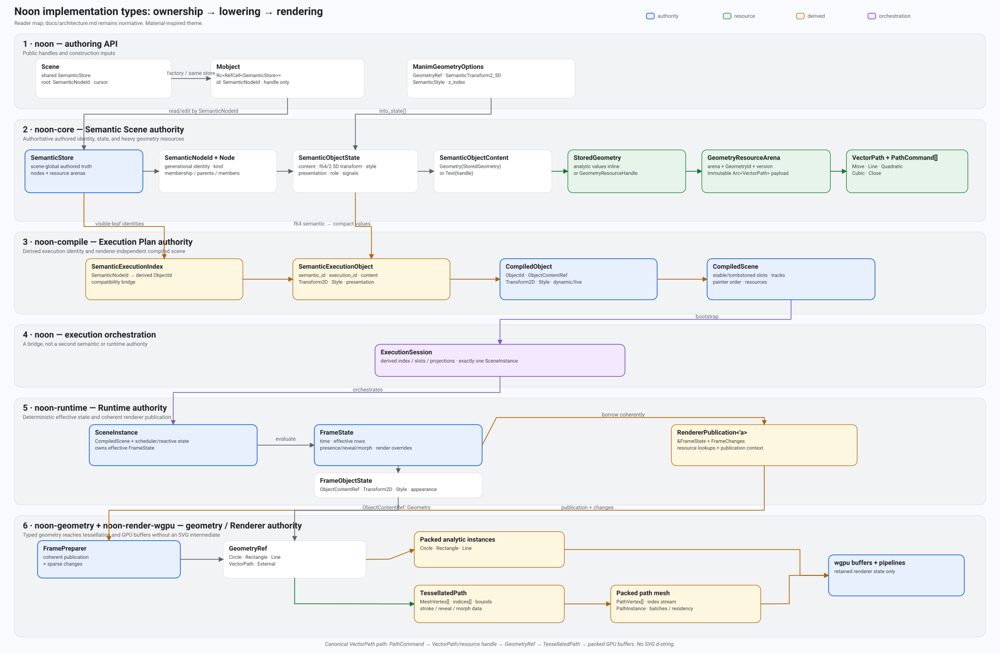
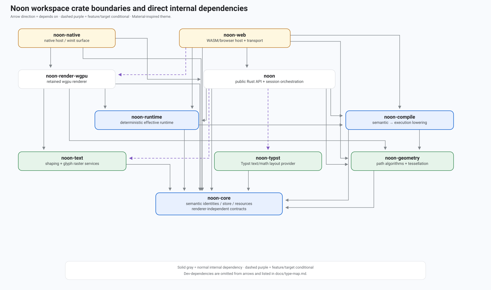

# Implementation type map and crate boundaries

This guide is a **reader-oriented map of the current implementation**: where important types live, what they own, what crosses each crate boundary, and how authored objects become runtime state and finally GPU geometry. It is deliberately descriptive rather than normative. [`docs/architecture.md`](architecture.md) remains the sole architecture/roadmap authority.

The Rust public type is spelled **`Mobject`**. This document uses that spelling even when discussing the Manim/Python concept commonly called an “MObject”.

## The two maps

The first map follows one object from public authoring through semantic ownership, compilation, runtime evaluation, and renderer preparation. The D2 source is the useful maintenance artifact; the SVG is a reader preview.



[D2 source: `type-lowering.d2`](type-lowering.d2)

The second map is the **internal Cargo dependency graph**. It is intentionally separate from the data-flow diagram: “crate A depends on crate B” and “data moves from layer A to layer B” are related but not identical statements.



[D2 source: `crate-dependencies.d2`](crate-dependencies.d2)

## One-minute mental model

A useful way to read the code is:

1. `Scene`, `Mobject`, `MobjectFamily`, animation handles, signal handles, and `LiveSession` are ergonomic **authoring/orchestration handles** in `noon`. They should not become a second scene model.
2. `SemanticStore` in `noon-core` is the **authored Semantic Scene authority**. A `Mobject` is only a store pointer plus a generational `SemanticNodeId` into that store.
3. `noon-compile` reads semantic state and derives an **Execution Plan**: execution identities/slots, compact values, tracks, reactive projections, painter order, and dependency-closed resources.
4. `ExecutionSession` in `noon` owns the orchestration needed to keep that compiled projection coherent with one `SceneInstance`; it does not own a second copy of `SemanticStore`.
5. `SceneInstance` in `noon-runtime` owns the current **effective** `FrameState`. Authored/base state and effective/time-varying state are therefore different by construction.
6. `RendererPublication` gives `noon-render-wgpu` one coherent borrowed frame, its sparse `FrameChanges`, resource lookups, and publication context.
7. Analytic primitives become packed analytic instances. `VectorPath` stays typed until `noon-geometry` tessellates it into mesh vertices/indices; `noon-render-wgpu` then packs and retains GPU buffers.

The most important rule for new code is: **do not move an authority upward just because a lower layer has a convenient representation of the same object**. `ObjectId`, frame indices, path cache indices, and GPU slots are all derived representations, not semantic identity.

## Crate boundaries

| Crate | Owns / is responsible for | Important types crossing its boundary | Direct internal dependencies |
| --- | --- | --- | --- |
| `noon-core` | Semantic identity/store, semantic object/family/signal/animation declarations, immutable resource arenas, renderer-independent compact value contracts | `SemanticStore`, `SemanticNodeId`, `SemanticObjectState`, `SemanticObjectContent`, `StoredGeometry`, `GeometryResourceHandle`, `VectorPath`, `PathCommand`, `ObjectContentRef`, `GeometryRef`, `Transform2D`, `Style` | none |
| `noon-geometry` | Renderer-independent path algorithms: boolean operations, morphing, outlines, partial paths, smoothing, tessellation | consumes `VectorPath`; produces `TessellatedPath`, `MeshVertex`, path bounds/progress | `noon-core` |
| `noon-compile` | Semantic-to-execution lowering, stable execution objects/slots, tracks, painter order, resource closure, incremental execution patches | `SemanticExecutionIndex`, `SemanticExecutionProjection`, `SemanticExecutionObject`, `CompiledObject`, `CompiledScene`, `CompiledResources`, `ExecutionPatch` | `noon-core`, `noon-geometry` |
| `noon-runtime` | Deterministic effective evaluation, scheduler/reactive state, current frame, sparse invalidation, renderer publication | `SceneInstance`, `FrameState`, `FrameObjectState`, `FrameChanges`, `RendererPublication`, `ExecutionSlotTable`, `RuntimeIdentity` | `noon-core`, `noon-compile` |
| `noon-render-wgpu` | Renderer preparation, packed instances, mesh residency/caching, painter-order draw preparation, WGPU resources/pipelines | consumes `FrameState`/`RendererPublication`; owns `FramePreparer`, `PreparedFrame`, packed analytic/path records | `noon-core`, `noon-geometry`, `noon-runtime`, `noon-text` |
| `noon` | Public Rust authoring API and typed execution-session orchestration; shared high-level operations used by frontends | `Scene`, `Mobject`, `MobjectFamily`, `LiveSession`, `ExecutionSession`, authoring options/errors | `noon-core`, `noon-geometry`, `noon-compile`, `noon-runtime`; optional `noon-text`, `noon-typst` |
| `noon-text` | CPU text shaping and glyph raster services | shared text/font resource values from `noon-core`, shaped/rasterized glyph data for renderer consumers | `noon-core` |
| `noon-typst` | Typst text/math layout provider | normalizes provider output into shared Noon resource/geometry types | `noon-core` |
| `noon-native` | Native window/event-loop/surface lifecycle and typed host execution | consumes public `noon` session/API and `noon-render-wgpu` | `noon`, `noon-core`, `noon-render-wgpu` |
| `noon-web` | WASM/browser host integration and explicit cross-context transport where required | typed direct Rust/WASM path plus browser/worker transport adapters | `noon`, `noon-core`, `noon-compile`, `noon-geometry`, `noon-runtime`; target/feature-dependent `noon-render-wgpu` |

Notable external dependency placement is also intentional:

- `noon-core` is lightweight (`serde` only) so semantic contracts are reusable.
- `noon-geometry` isolates `lyon_*` and `i_overlay`.
- `noon-render-wgpu` isolates `wgpu`, `bytemuck`, and renderer-side `swash` use.
- `noon-native` isolates `winit`, native WGPU backend selection, and `pollster`.
- `noon-web` isolates `wasm-bindgen`, `web-sys`, `js-sys`, transport codecs, and browser-target WGPU.
- `noon-text` isolates shaping/raster dependencies; `noon-typst` isolates the Typst toolchain.

### Cargo dependency graph versus execution data flow

The internal Cargo graph points from a consumer crate to crates it imports. The execution path reads in the opposite conceptual direction in several places: semantic values defined in `noon-core` are **consumed by** `noon-compile`, which is consumed by `noon-runtime`, which is consumed by the renderer. Keep those views separate when reasoning about ownership.

For example, `noon-render-wgpu` has a Cargo dependency on `noon-runtime`, but runtime state does not belong to the renderer. The renderer only receives a publication/observation of runtime state and builds disposable renderer-owned caches from it.

## `Mobject`: what it actually is

The public Rust handle is intentionally tiny. Its durable data is not stored in the handle:

```rust
#[derive(Clone, Debug)]
pub struct Mobject {
    store: Rc<RefCell<SemanticStore>>,
    id: SemanticNodeId,
}
```

Source: [`crates/noon/src/semantic_mobject.rs`](../crates/noon/src/semantic_mobject.rs).

That definition has several consequences:

- Cloning the Rust handle clones the `Rc` and the ID; it does not clone object geometry/state.
- The ID is meaningful only with its originating store. Cross-store operations are rejected.
- Stale generational IDs fail validation instead of accidentally naming a later object that reused storage.
- Object queries read the current `SemanticObjectState` from the store.
- Object edits stage canonical semantic mutations; the handle never becomes an independent mutable mirror.

`Scene` follows the same pattern. It stores the shared semantic arena, one family root ID, and an authoring cursor:

```text
Scene
├── store: Rc<RefCell<SemanticStore>>
├── root: SemanticNodeId
└── cursor: f64
```

See [`crates/noon/src/scene.rs`](../crates/noon/src/scene.rs). `Scene::circle`, `Scene::rectangle`, `Scene::line`, `Scene::path`, text constructors, etc. create detached semantic nodes in that shared store; `Scene::add` changes membership of the existing node rather than copying it into a second scene container.

### Construction path

For geometry authoring, `ManimGeometryOptions` is inert typed input. It carries a `GeometryRef`, a high-precision `SemanticTransform2_5D`, `SemanticStyle`, and `z_index`, but it owns no semantic identity or runtime state.

The important construction sequence is:

```text
Scene constructor / ManimGeometryOptions
        ↓
Mobject::from_manim_geometry(...)
        ↓
ManimGeometryOptions::into_state(store)
        ↓
import_geometry(store, GeometryRef)
        ↓
SemanticObjectState
        ↓
SemanticMutationTransaction::add_node(...)
        ↓
SemanticStore allocates SemanticNodeId
        ↓
Mobject { store, id }
```

`Mobject::new` gets the permanent identity from the committed transaction result. That is why code should not invent IDs in facade/frontend layers.

### Mutation path

Most persistent `Mobject` methods follow the same shape:

1. validate the handle;
2. read the current `SemanticObjectState`;
3. modify a local copy/value;
4. `commit_state` computes the semantic differences;
5. `stage_state_changes` emits canonical transaction operations such as `replace_content`, `set_property`, or `replace_style`;
6. the transaction applies atomically to `SemanticStore`.

Before execution bootstrap, these are authored edits. After an `ExecutionSession` exists, use `Scene::live(&mut session)`/`LiveSession` for supported live changes so authored and effective publication stay coherent. Raw mutable store access is an integration escape hatch, not a live-edit API.

## Semantic object representation

A semantic object is not represented by one giant `Mobject` record. The key types are split by purpose.

### Identity and node topology

`SemanticNodeId` is the **scene-global generational semantic identity**. `SemanticStore` owns an arena of `SemanticNode`s. `SemanticNodeKind` distinguishes object, family, signal, and animation nodes, while the node also carries membership/parentage and other topology needed by the semantic scene.

This identity is the one callers should preserve across semantic operations. Lower layers may derive keys/indices from it, but they do not replace it as authored identity.

### Object state

`SemanticObjectState` is the authoritative authored object payload. Conceptually:

```text
SemanticObjectState
├── content: SemanticObjectContent
├── transform: SemanticTransform2_5D       # f64, authored/base
├── style: SemanticStyle                    # authored paint/stroke/opacity
├── presentation: SemanticPresentation      # z-index/insertion ordering
├── role: SemanticObjectRole
└── signal_bindings: Vec<SemanticSignalBinding>
```

Bounds are intentionally derived rather than stored as another source of truth.

### Content and geometry resources

`SemanticObjectContent` is currently either:

```text
Geometry(StoredGeometry)
Text(TextResourceHandle)
```

`StoredGeometry` deliberately treats cheap analytic values and heavy path payloads differently:

```rust
pub enum StoredGeometry {
    Circle { radius: f32 },
    Rectangle { size: Vec2 },
    Line { start: Vec2, end: Vec2 },
    Resource(GeometryResourceHandle),
}
```

A `GeometryResourceHandle` includes the owning arena namespace, a generational `GeometryId`, and a resource version. The arena stores immutable `GeometryResource::VectorPath(Arc<VectorPath>)` payloads. Replacing a resource can keep its stable ID while incrementing the version, which invalidates old snapshots/caches cleanly.

This is why a large path is not copied into every semantic object or track snapshot: the semantic layer copies a small versioned handle while the heavy immutable path stays arena-owned.

## Identity ladder: do not confuse these IDs

| Identity / index | Layer | Meaning | Stable semantic identity? |
| --- | --- | --- | --- |
| `SemanticNodeId` | Semantic Scene | generational ID for object/family/signal/animation node in one `SemanticStore` | **yes** |
| `GeometryResourceHandle` | Semantic resources | arena + generational `GeometryId` + immutable resource version | resource identity, not object identity |
| `ObjectId` from `SemanticExecutionIndex` | Compiler | derived compatibility key accepted by the current compiled/runtime object domain | **no**; do not expose as new authoring identity |
| compiled object slot / object index | Execution Plan | stable/tombstoned storage location used by compiled/runtime structures | no |
| `RuntimeIdentity` | Runtime | identifies one mutable `SceneInstance` incarnation/session runtime | no; identifies runtime, not object |
| `FrameState` row index | Runtime observation | dense effective row for current compiled slot domain | no |
| `FramePreparer` instance index / path cache index | Renderer | packing/cache bookkeeping for a prepared frame | no |
| WGPU buffer offsets / draw batch indices | Renderer/device | disposable GPU submission/storage positions | no |

`SemanticExecutionIndex` is explicitly a compiler-owned bridge from `SemanticNodeId` to the existing `ObjectId` domain. New semantic APIs should not grow around `ObjectId` merely because it is convenient in compile/runtime code.

## Precision and representation ladder

Another common source of confusion is seeing similarly named values with different precision/semantics:

| Stage | Transform/style representation | Why |
| --- | --- | --- |
| Semantic authored/base | `SemanticTransform2_5D` + `SemanticStyle` | high-precision authored semantics, 2.5D-compatible shape |
| Compile/runtime execution | `Transform2D` + `Style` | compact execution-facing values; lowering validates finite/range constraints |
| Renderer upload | `PackedTransform` + `PackedStyle` | WGPU-friendly POD layout |

Lowering from semantic values is explicit. For example `SemanticVec3::lower_xy_f32` and compile-side scalar lowering reject non-finite/out-of-range values instead of silently changing meaning.

## End-to-end path: `Mobject` to actual GPU path

This is the concrete trace for a vector path, including the representations that are easy to miss when reading only one crate.

### 1. Authoring starts with typed `VectorPath`

`VectorPath` and `PathCommand` live in `noon-core`. A path owns an ordered command stream (`MoveTo`, `LineTo`, `QuadraticTo`, `CubicTo`, `Close`) plus optional morph-target data. `Scene::path` passes it through ordinary shared Rust authoring.

At this boundary `ManimGeometryOptions`/constructor helpers may use `GeometryRef::VectorPath` as **input vocabulary**. That does not mean `GeometryRef` is the persistent semantic storage model.

### 2. Authoring imports heavy geometry into the semantic resource arena

`semantic_mobject::import_geometry` converts constructor `GeometryRef` into persistent `StoredGeometry`:

```text
GeometryRef::Circle       → StoredGeometry::Circle        (inline)
GeometryRef::Rectangle    → StoredGeometry::Rectangle     (inline)
GeometryRef::Line         → StoredGeometry::Line          (inline)
GeometryRef::VectorPath   → insert path in arena
                           → StoredGeometry::Resource(handle)
GeometryRef::External     → rejected by ordinary authoring
```

For a path, the heavy payload becomes `GeometryResource::VectorPath(Arc<VectorPath>)`; the semantic object retains only the versioned handle.

### 3. The semantic node owns the authored object state

The committed object node points to `SemanticObjectState`, whose `content` is `SemanticObjectContent::Geometry(StoredGeometry::Resource(handle))`. `Mobject` itself still owns only `(store, SemanticNodeId)`.

### 4. `noon-compile` derives an execution projection

`SemanticExecutionIndex::lower_scene`/`lower_root` traverses visible semantic leaves and produces `SemanticExecutionObject`s. This step:

- preserves the authoritative `semantic_id`;
- derives the current compatibility `ObjectId`;
- carries semantic content/resource handles forward long enough to validate/resolve them;
- lowers high-precision transforms/styles into compact `Transform2D`/`Style`;
- preserves presentation and authored signal-binding information needed by later lowering.

Importantly, lowering validates all visible objects before mutating the semantic-to-execution identity index, so a late failure cannot publish a partially updated mapping.

### 5. `CompiledScene` materializes renderer-independent execution content

During compiled-scene materialization, `lower_content` resolves `StoredGeometry` using the originating store/resource closure:

```text
StoredGeometry::Circle/Rectangle/Line
    → matching GeometryRef analytic value

StoredGeometry::Resource(handle)
    → GeometryResourceArena lookup(handle)
    → GeometryResource::VectorPath(Arc<VectorPath>)
    → GeometryRef::VectorPath(VectorPath)
```

The resulting `CompiledObject` contains an `ObjectContentRef` (`Geometry(GeometryRef)` or `Text(handle)`), compact transform/style, execution key, and dynamic/live metadata. `CompiledScene` owns the stable/tombstoned execution slot domain, tracks, painter order, and dependency-closed immutable resources.

This is the boundary where semantic resource identity is resolved into a renderer-independent **execution value**. The renderer still does not know about `Mobject`, `SemanticNode`, or `SemanticStore`.

### 6. Runtime owns the current effective row

`SceneInstance` is created from the compiled plan and owns the current `FrameState`. Each `FrameObjectState` contains:

```text
ObjectId
ObjectContentRef
Transform2D
Style
z_index / appearance
```

Parallel arrays hold presence, reveal, morph, family-animation state, and optional derived render geometry/transform overrides. `FrameState::render_geometry(i)` selects a temporary derived render geometry when an animation needs one; otherwise it returns the object's ordinary geometry.

That override is **derived animation state**. It does not replace the semantic object's persistent content.

### 7. Runtime publishes one coherent renderer observation

`SceneInstance::take_renderer_publication()` bundles:

- `&FrameState`;
- accumulated sparse `FrameChanges`;
- publication/revision context;
- immutable text/font/geometry resource lookups;
- family-animation plans and painter order.

`RendererPublication` is borrowed and coherent. It is not a second retained render-world model.

### 8. Renderer splits analytic and vector-path preparation

`noon-render-wgpu::FramePreparer` reads effective `frame.render_geometry(object_index)`.

Analytic primitives avoid general tessellation:

```text
Circle      → CircleInstance
Rectangle   → RectangleInstance
Line        → LineInstance
```

A `GeometryRef::VectorPath` enters the path preparation/cache branch.

### 9. `noon-geometry` tessellates the typed path

On a path cache miss, renderer preparation calls `noon-geometry` tessellation. The tessellator converts `PathCommand`s into Lyon paths and produces:

```text
TessellatedPath
├── vertices: Vec<MeshVertex>
│   ├── position
│   ├── target_position          # morph endpoint when relevant
│   ├── surface: Fill | Stroke
│   ├── path_distance
│   └── path_progress
├── indices: Vec<u32>
├── bounds
├── stroke_length
├── morphing
└── cached reveal measure
```

Stroke join/cap/width and fill participation are inputs to tessellation. For screen-space strokes, renderer preparation may bake scale/rotation (not translation) into the tessellation path so stroke width semantics remain screen-space. Morphing can use the order-preserving tessellation variant required by compatibility behavior.

### 10. Renderer packs mesh residency and WGPU upload data

`noon-render-wgpu` converts tessellated mesh data into its own retained GPU-facing representation:

- `PathVertex` (`position`, `target_position`, packed surface/progress metadata);
- `PathInstance` (packed transform/style + reveal/morph parameters);
- path index streams and batches;
- unique-path/mega-mesh residency/cache records;
- WGPU vertex/index/instance buffers and ordered draw metadata.

Renderer cache keys and buffer offsets are disposable optimization details. Changing a transform/color should not force path retessellation when the geometry/tessellation inputs did not change.

### 11. There is no canonical SVG-path lowering step

The direct native/browser renderer path is:

```text
PathCommand
  → VectorPath
  → semantic geometry resource handle
  → compiled GeometryRef::VectorPath
  → runtime effective geometry
  → TessellatedPath
  → PathVertex/index buffers
  → WGPU draw
```

It does **not** lower through an SVG `d` string. SVG/debug/export representations, where present, are explicit codecs or diagnostics rather than the engine's canonical execution boundary.

## Execution/session types around the object path

### `ExecutionSession`

`ExecutionSession` is the typed orchestration bridge between the authored store and one runtime. Its fields are deliberately derived/runtime structures: store identity, `SemanticExecutionIndex`, reachability, execution slots, spatial index, reactive projection, signal timeline, one `SceneInstance`, callback/completion state, etc.

It explicitly does **not** own or mirror `SemanticStore`. This matters for live mutation: semantic transactions remain the source of authored truth; execution publication updates the derived execution/runtime state only after preparation succeeds.

### `LiveSession`

`Scene::live(&mut ExecutionSession)` returns the public live-operation facade. Use it for supported persistent edits, membership changes, animation activation/completion, effective queries, and other operations that must publish semantic and execution changes coherently.

The facade should not accumulate a parallel scene model. If a new live feature seems to require copying semantic state into `LiveSession`, look for a semantic transaction + lowering/publication solution first.

### `SceneInstance`

`SceneInstance` is runtime authority, not semantic authority. It owns the compiled plan it is executing, the current `FrameState`, scheduling/group cursors, reactive runtime, sparse invalidation, publication context, and active derived animation state. Seeking/advancing changes this effective state without rewriting authored semantic declarations.

## Other important type families

The same boundary pattern applies beyond geometry.

| Domain | Semantic/authored types | Compile/runtime derived types | Notes |
| --- | --- | --- | --- |
| Families / membership | `SemanticNodeId`, family `SemanticNodeKind`, ordered members/parents in `SemanticStore`; public `MobjectFamily` handle | reachability, painter order/ranks, execution slots | family topology belongs to semantic scene; runtime observes derived flattened order |
| Animation | semantic animation nodes/declarations, public declared animation handles/options | compiled tracks/channels/family plans, runtime scheduler/group state, frame reveal/morph/temporary render overrides | animation declarations are not frame state; frame state is not authored truth |
| Signals / reactive state | semantic signal nodes, `SemanticSignalBinding`, native/host source declarations | `SemanticReactiveProjection`, runtime reactive program/state and dirty closure | signal identity stays semantic; execution slots are derived |
| Text | `TextResourceHandle`, font/text resources and semantic content handles | `CompiledResources`, frame text handles/bounds, `noon-text` shaping/raster output, renderer atlas entries | text/font resource closure is captured during lowering; renderer atlas IDs are not semantic IDs |
| Presentation/order | `SemanticPresentation` (`z_index`, insertion order) | compiled painter order/ranks; runtime order updates; renderer ordered batches/chunks | transform/style should not become an ordering authority |
| Camera | canonical semantic camera object | derived `ObjectId`/effective frame camera values | camera value is read from effective runtime state, not retained as a separate host-owned scene |

## Source index: where to start reading

For a code-first walkthrough, these files give the shortest route through the system:

1. [`crates/noon/src/scene.rs`](../crates/noon/src/scene.rs) — scene/store/root ownership and public factories.
2. [`crates/noon/src/semantic_mobject.rs`](../crates/noon/src/semantic_mobject.rs) — `Mobject`, geometry import, persistent object mutations.
3. [`crates/noon-core/src/semantic_store.rs`](../crates/noon-core/src/semantic_store.rs) — semantic arena/topology and transactions.
4. [`crates/noon-core/src/semantic_store/semantic_model.rs`](../crates/noon-core/src/semantic_store/semantic_model.rs) — `SemanticNode`, `SemanticObjectState`, high-precision semantic values.
5. [`crates/noon-core/src/semantic_store/object_content.rs`](../crates/noon-core/src/semantic_store/object_content.rs) — semantic content and lowered `ObjectContentRef` vocabulary.
6. [`crates/noon-core/src/resources/geometry.rs`](../crates/noon-core/src/resources/geometry.rs) — `StoredGeometry`, versioned geometry handles, immutable path resource arena.
7. [`crates/noon-compile/src/semantic_lowering/projection.rs`](../crates/noon-compile/src/semantic_lowering/projection.rs) — semantic identity/value projection into execution-facing objects.
8. [`crates/noon-compile/src/semantic_lowering/compiled_scene.rs`](../crates/noon-compile/src/semantic_lowering/compiled_scene.rs) — resource resolution and `CompiledObject`/`CompiledScene` materialization.
9. [`crates/noon/src/execution_session.rs`](../crates/noon/src/execution_session.rs) — typed semantic/execution orchestration.
10. [`crates/noon-runtime/src/frame.rs`](../crates/noon-runtime/src/frame.rs) — effective frame rows and render overrides.
11. [`crates/noon-runtime/src/renderer_publication.rs`](../crates/noon-runtime/src/renderer_publication.rs) — coherent frame/change/resource publication.
12. [`crates/noon-geometry/src/tessellation.rs`](../crates/noon-geometry/src/tessellation.rs) — typed path → mesh conversion.
13. [`crates/noon-render-wgpu/src/lib.rs`](../crates/noon-render-wgpu/src/lib.rs) — frame preparation, analytic packing, path mesh caching/packing.
14. Workspace and per-crate `Cargo.toml` files — actual dependency edges; use them rather than inferring dependencies from call flow.

## Where should a new type or behavior go?

Use this as a practical placement check:

| If the change is primarily about… | Start in… | Avoid putting it in… |
| --- | --- | --- |
| authored identity, topology, persistent content/style/transform, semantic invariants | `noon-core` semantic store/model | renderer, host wrappers |
| public Rust ergonomics or a shared high-level authoring operation | `noon` | Python/browser-only facade code |
| translating semantic declarations into execution slots/tracks/resources | `noon-compile` | runtime or renderer caches |
| time evaluation, effective state, scheduling, reactive propagation, sparse dirty state | `noon-runtime` | semantic store |
| path algorithms/tessellation independent of GPU API | `noon-geometry` | WGPU renderer |
| GPU packing, mesh residency, batches, shaders, dirty uploads | `noon-render-wgpu` | semantic/compile layers |
| native window/surface/event lifecycle | `noon-native` | renderer core |
| browser/WASM/platform or genuine cross-worker transport | `noon-web` | semantic authority |
| text shaping/raster provider work | `noon-text` | core semantic store beyond shared resource contracts |
| Typst compilation/layout provider work | `noon-typst` | renderer/runtime |

If a change seems to need state in two authority layers, first ask whether one copy can instead be a derived projection, handle, immutable resource reference, or bounded cache.

## Common traps for readers and contributors

- **`Mobject` is not the object record.** It is `(store, SemanticNodeId)`.
- **`GeometryRef` has more than one role.** It is convenient typed geometry input and the renderer-independent execution geometry value, but persistent semantic heavy-path storage is `StoredGeometry::Resource(handle)`.
- **`ObjectId` is not the new semantic ID.** It is currently a derived compiler/runtime compatibility key.
- **A runtime frame is not authored truth.** `FrameState` is the effective result at a particular time/publication.
- **A renderer cache is not runtime truth.** `PreparedFrame`, mesh residency, instance indices, and GPU buffers are disposable renderer state.
- **Temporary render geometry is not persistent `become()` state.** Animation-time correspondence can produce derived `render_geometries`; persistent semantic topology/content changes still go through semantic publication.
- **Cargo dependency direction is not ownership direction.** A crate can depend on another crate's types without taking ownership of that layer's authority.
- **Serialization is not the normal in-process boundary.** Native and single-context Rust/WASM paths should continue passing typed Rust values directly; codecs belong at explicit wire/storage boundaries.
- **Do not bypass resource handles for heavy semantic paths.** They exist to keep immutable payload ownership bounded and versioned.

## Keeping this guide current

This file should change when **implementation types or crate handoffs move**, not when a new roadmap decision is made. Architectural decisions belong in [`docs/architecture.md`](architecture.md).

When updating the guide:

1. re-check the current `Cargo.toml` graph;
2. trace the concrete types rather than relying on older diagrams/comments;
3. keep `SemanticNodeId` versus derived execution/renderer identities explicit;
4. update the D2 source beside the affected map;
5. refresh the reader SVG preview;
6. avoid turning this document into a second architecture roadmap.
